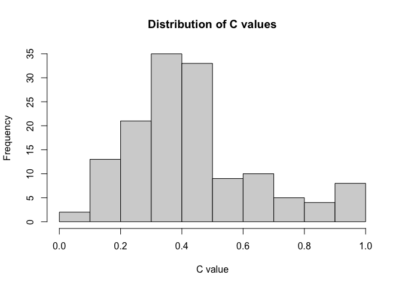

Network Science Group 9, Assignment Two
================
- Elviss Dvinskis, 2459302
- Maryam Afshari, 5117259
- Wulan Putri Handrajati,
7369921
- Koray Poyraz, 5367646
- Deadline: 3/12/2022

``` r
library(igraph) 
library(ggplot2)
library(network)
library(intergraph) 
library(RColorBrewer)
library(dplyr)
library(visNetwork)
library(htmlwidgets)
library(greed)
```

# Exercise 1 Build and analyse a small network from Facebook

``` r
nodes <- read.csv("Facebook_att.csv", header = TRUE)
links <- read.csv("Facebook_edge.csv", header = TRUE)
```

``` r
nodes[1:5,]
```

    ##   friend_count          group mutual_friend_count relationship_status    sex
    ## 1           73         Family                  37             Married female
    ## 2           53 GraduateSchool                   3             Married   male
    ## 3          363 GraduateSchool                   3             Married female
    ## 4           64 GraduateSchool                   4                     female
    ## 5           19         Family                  10                     female
    ##   vertex.names NodeID
    ## 1           SE      1
    ## 2           PH      2
    ## 3           PD      3
    ## 4           LN      4
    ## 5           MB      5

``` r
# links
```

``` r
?graph_from_data_frame
?asNetwork

facebook <- graph_from_data_frame(d = links, vertices = nodes$NodeID, directed = FALSE)
facebook_net <- asNetwork(facebook)
facebook_net
```

    ##  Network attributes:
    ##   vertices = 93 
    ##   directed = FALSE 
    ##   hyper = FALSE 
    ##   loops = FALSE 
    ##   multiple = FALSE 
    ##   bipartite = FALSE 
    ##   total edges= 322 
    ##     missing edges= 0 
    ##     non-missing edges= 322 
    ## 
    ##  Vertex attribute names: 
    ##     vertex.names 
    ## 
    ## No edge attributes

``` r
facebook_net %v% "vertex.names" <- nodes$vertex.names
facebook_net %v% "sex" <- nodes$sex
facebook_net %v% "friend_count" <- nodes$friend_count
facebook_net %v% "group" <- nodes$group
facebook_net %v% "mutual_friend_count" <- nodes$mutual_friend_count
facebook_net %v% "relationship_status" <- nodes$relationship_status
```

``` r
#summary(facebook_net)
```

``` r
plot(facebook_net, vertex.cex = 1.2, main = "Basic plot of Douglas’s Facebook friends")
```

<!-- -->

### Question 1.1: Check out the Summary and Plot, how many friends do Douglas have on Facebook? Is this a directed or undirected graph and why? What is the meaning of the link between nodes in the plot? \[Question 1, 2 points\].

#### How many friends do Douglas have on Facebook?

Douglas has 93 friends.

#### Is this a directed or undirected graph and why?

This is a undirected graph because the edges do not have a direction.

#### What is the meaning of the link between nodes in the plot?

It basically shows your friends, who are also friends between them

``` r
length(nodes$friend_count)
```

    ## [1] 93

### Question 1.2: Compare the degree, closeness and betweenness of Vertex 1 to the values of other nodes in the network. How will you evaluate the role of Vertex 1 in this network? \[Question 2, 3 points\].

#### Degree

The nod has 32 edges/friends.

#### Closeness

The closeness centrality is low, meaning that that nod/person is not the
closest one to all other persons, it costs more edges. Some other nod in
the network has a mean shorter distance to other nodes in the network.

#### Betweenness

Has low betweenness centrality, meaning does not often form a bridge
between nods/persons (does not frequently lie on the shortest path
between nods in the network).

``` r
vertex_ID = 1
df_metrics = data.frame(
  degree = degree(facebook, v = vertex_ID, mode = "total"),
  closeness = closeness(facebook, v = vertex_ID, normalized = TRUE),
  betweenness = betweenness(facebook, v = vertex_ID, directed = FALSE, normalized = TRUE)
)
```

    ## Warning in closeness(facebook, v = vertex_ID, normalized = TRUE): At
    ## centrality.c:2874 :closeness centrality is not well-defined for disconnected
    ## graphs

``` r
df_metrics
```

    ##   degree  closeness betweenness
    ## 1     32 0.02120793   0.1411131

### Question 1.3: In the lecture, we introduced a few measures of centrality: degree, betweenness, eigenvector. Try to find top 5 nodes according to a) degree, b) betweenness, c) closeness and d) eigenvector. And develop the scatter plot between different metrics, you can refer to the code below. Discuss with your group and describe to your teacher, 1) how well does the top 5 nodes by different metrics overlap with each other? 2) why we need more than one metric to define centrality? \[Question 3, 5 points\]

``` r
library(scales)
vertex_ID = 1
df_metrics = data.frame(
  nodeID = nodes$NodeID,
  degree = degree(facebook, mode = "all"),
  closeness = closeness(facebook, normalized = TRUE),
  betweenness = betweenness(facebook, directed = FALSE, normalized = TRUE),
  eig = eigen_centrality(facebook)$vector,
  lcl = transitivity(facebook, type = "local")
)
```

    ## Warning in closeness(facebook, normalized = TRUE): At
    ## centrality.c:2874 :closeness centrality is not well-defined for disconnected
    ## graphs

``` r
top_5 = df_metrics[order(-df_metrics$degree, -df_metrics$closeness, -df_metrics$betweenness, -df_metrics$eig),][1:5,]
coloring = ifelse(df_metrics$nodeID %in% top_5$nodeID, 'red', 'blue')

par(mfrow = c(2,2))

plot(df_metrics$degree, df_metrics$closeness, main = "Degree versus closeness", xlab = "Degree", ylab = "Closeness", col=alpha(coloring, 0.4))

plot(df_metrics$degree, df_metrics$betweenness, main = "Degree versus betweenness", xlab = "Degree", ylab = "Betweenness", col=alpha(coloring, 0.4))

plot(df_metrics$degree, df_metrics$eig, main = "Degree versus eigenvector", xlab = "Degree", ylab = "Eigenvector", col=alpha(coloring, 0.4))

plot(df_metrics$degree, df_metrics$lcl, main = "Degree versus local clustering", xlab = "Degree", ylab = "Local clustering", col=alpha(coloring, 0.4))
```

<!-- -->

``` r
top_5
```

    ##    nodeID degree  closeness betweenness       eig       lcl
    ## 1       1     32 0.02120793 0.141113068 1.0000000 0.3024194
    ## 12     12     21 0.02110576 0.013670660 0.9012656 0.5809524
    ## 23     23     19 0.02110576 0.015852965 0.8305933 0.6140351
    ## 31     31     19 0.02108641 0.002138961 0.9016029 0.7192982
    ## 26     26     18 0.02108158 0.001726770 0.8678475 0.7385621

#### how well does the top 5 nodes by different metrics overlap with each other?

-   In degree nods 23 and 31 overlap.
-   In closeness nods 23 and 31 overlap.
-   In betweenness Node 1 has the highest and there is no overlap.
-   In eigenvector nods don’t overlap.

#### why we need more than one metric to define centrality?

Because Centrality describes who is a central actor and it might be
handy to analyse in which context a actor has a central behavior.

### Question 1.4: Discuss within your group on how you understand each of these measures. And describe to your teacher, 1) why diameter should be larger than 1, and other metrics such as edge density and transitivity are smaller than 1? 2) is this a tightly knitted network? \[Question 4, 3 point\].

``` r
deg_dist <- degree_distribution(facebook)
barplot(deg_dist)
```

<!-- -->

``` r
tibble(
  edge_density = edge_density(facebook),
  diameter = diameter(facebook, directed = FALSE),
  transitivity = transitivity(facebook, type = "global"),
  centr_degree = centr_degree(facebook)$centralization
)
```

    ## # A tibble: 1 × 4
    ##   edge_density diameter transitivity centr_degree
    ##          <dbl>    <dbl>        <dbl>        <dbl>
    ## 1       0.0753        4        0.665        0.273

#### why diameter should be larger than 1?

Because its a count of edges between the shortest path, and the number
of edges is always N-1. So having diameter of 1 would lead to 1-1=0.
Meaning no connection.

#### why other metrics such as edge density and transitivity are smaller than 1?

In edge density, knowing that degree lies between 0 and 1 which can be
seen as a probability that a pair of nodes, picked uniformly at random
from the whole network, is connected by an edge. Furthermore, there is
low cohesiveness, explaining the quality of cooperation in the network.

In transitivity, 1 would imply that all nodes in a component are
connected to all others which is not the case with 0.66.

In central degree, shows the centrality score based on node-level
centrality. In this case the score is low meaning in the network there
is less node-level centrality.

#### is this a tightly knitted network?

There is some degree of being tightly knit network due to components
having closely linked nods.

### Question 1.5: Reflect on what we have discussed about the Facebook network on Slide 42 of the lecture. Do you think this small network of Douglas resonates some general patterns of the entire Facebook network in terms of the components size and number? How can you explain such an observation \[Question 5, 3 point\].

``` r
barplot(components(facebook)$csize, names.arg=c(1:components(facebook)$no))
```

<!-- -->

``` r
nodes['compID'] <- components(facebook)$membership
```

``` r
factor(nodes[nodes$compID == 1, ]$group)['levels']
```

    ## [1] <NA>
    ## Levels: BookClub Family GraduateSchool Music Work

``` r
nodes[nodes$compID == 7, ]$group
```

    ## [1] "HighSchool" "HighSchool" "HighSchool" "HighSchool" "Music"

### Question 1.6: From the plot you produced, do you find instances of intermingling of Douglas friends (i.e., belong to different groups but end up in the same component)? Do you find any isolated groups here? What can you conclude about the mixing of Douglas’ Facebook friends? \[Question 6, 3 point\].

``` r
group <- as.factor(get.vertex.attribute(facebook_net, attrname = 'group'))
pal <- brewer.pal(nlevels(group), "Set1")

plot(facebook_net, vertex.col = pal[group], vertex.cex = 1.5, main = "Plot of Facebook Data colored by friend type") 
legend(x = "bottomleft", legend = levels(group), col = pal, pch = 19, pt.cex = 1.2, bty = "n", title = "Friend type")
```

<!-- -->

#### Belong to different groups but end up in the same component?

Yes, in component 1 there are groups from family, book club, graduate
school and music (don’t know maybe play in a band). Work is not
isolated, because it is also occurs in component 1. The group spiel
(brown) is isolated, because it exists in one component. The group
college (blue) is isolated in a sense, it is isolated in different
components but doesn’t overlap.

#### Do you find any isolated groups here?

Yes, brown and blue are isolated.

#### What can you conclude about the mixing of Douglas’ Facebook friends?

About mixing we can conclude that he has a separated work life and
personal life.

### Question 1.7: Using the above code as a reference, check out the attributes of other factors (e.g., sex, relationship_status) in terms of people in the same components. Note that you can specify the ‘attrname’ parameter within the function ‘get.vertex.attribute’. Discuss with your group and describe to your teacher whether or not these factors are the keys in determining the formation of components \[Question 7, 3 point\].

``` r
group <- as.factor(get.vertex.attribute(facebook_net, attrname = 'sex'))
pal <- brewer.pal(nlevels(group), "Set1")
```

    ## Warning in brewer.pal(nlevels(group), "Set1"): minimal value for n is 3, returning requested palette with 3 different levels

``` r
plot(facebook_net, vertex.col = pal[group], vertex.cex = 1.5, main = "Plot of Facebook Data colored by sex type") 
legend(x = "bottomleft", legend = levels(group), col = pal, pch = 19, pt.cex = 1.2, bty = "n", title = "Sex type")
```

<!-- -->

#### Sex as an attribute

So looking at sex - it is not a key factor, it has not an effect on to
determine the components. We have two levels, were the majority of the
components have both sexes.

``` r
group <- as.factor(get.vertex.attribute(facebook_net, attrname = 'relationship_status'))
pal <- brewer.pal(nlevels(group), "Set1")

plot(facebook_net, vertex.col = pal[group], vertex.cex = 1.5, main = "Plot of Facebook Data colored by relationship_status type")
legend(x = "bottomleft", legend = levels(group), col = pal, pch = 19, pt.cex = 1.2, bty = "n", title = "relationship_status type")
```

<!-- -->

#### Relationship

The same idea as above applies as well for “relationship status”.

### Question 1.8: From this analysis, what do you observe from the density values? Are they similar across different groups? What is the minimum and maximum value you observed here and how do you explain that? \[Question 8, 4 point\].

``` r
groups <- as.factor(get.vertex.attribute(facebook_net, attrname = 'group'))

for (x in levels(groups)){
  y <- get.inducedSubgraph(facebook_net, which(facebook_net %v% "group" == x))
  print(paste0("Density for ", x, " friends is ", edge_density(asIgraph(y))))
}
```

    ## [1] "Density for BookClub friends is 1"
    ## [1] "Density for College friends is 0.19047619047619"
    ## [1] "Density for Family friends is 0.624505928853755"
    ## [1] "Density for GraduateSchool friends is 0.266666666666667"
    ## [1] "Density for HighSchool friends is 0.3"
    ## [1] "Density for Music friends is 0.316666666666667"
    ## [1] "Density for Spiel friends is 1"
    ## [1] "Density for Work friends is 0.3"

#### Answer

There are various densities across groups. Some groups are similar such
as Work and Music and HighSchool, Bookclub and Spiel. The maximum is 1
and minimum 0.19.

Knowingly that density lies between the range 0 and 1, the sub-networks
varies in everyone knows each other and only few know each other. For
example, density of BookClub and Spiel is 1 because everyone knows each
other whereas example Work and Music friends is 0.3 because only few of
the friends know each other.

### Question 1.9: To answer this question, search and discuss within your group on the theory of ‘community detection’. Describe to your teacher what community detection is, and why it is useful to understand complex networks \[Question 9, 8 point\].

#### Theory:

Community detection is a analysis technique, sometimes called
clustering. The goal of community detection is to find the natural
divisions of a network into groups of nodes such that there are many
edges within groups (tightly connected) and few edges between them
(loosely connected). Or in other words, it helps us to reveal the hidden
relations among the nodes in the network. Furthermore, community
detection methods can be categorized into two types; Agglomerative
Methods and Divisive Methods. In Agglomerative methods, edges are added
one by one to a graph which only contains nodes. Edges are added from
the stronger edge to the weaker edge. Whereas, Divisive methods follow
the opposite of agglomerative methods. In there, edges are removed one
by one from a complete graph. There exist several community detection
algorithms.

#### why it is useful to understand complex networks?

Well, a complex network e.g. with a million or more nodes can rarely be
visualized in its entirety. Such networks are simply too big to be
represented usefully on the screen. If the nodes of the network divide
naturally into groups, however, then we can make a simpler but still
useful picture by representing each group as a single node and the
connections between groups as edges. This simplified representation
allows us to see the large-scale structure of the network without
getting bogged down in the details of the individual nodes. In other
words, it gives the possibility to analyse big networks from a bird-eye
view by dividing it into groups naturally, to understand the connections
within the groups and between the groups. For instance, applying to
social media algorithms to discover people with common interests and
keep them tightly connected.

### Question 10: Compare the plots that you generate from the different algorithms; do you find them similar and Why? Do you think this observation (similar or not similar by using different community detection algorithms) holds in more complex network? \[Question 10, 5 point\].

``` r
cw <- cluster_walktrap(facebook)
plot(cw, facebook, vertex.label = V(facebook)$group,
     main = "Walktrap")
```

<!-- -->

``` r
ceb <- cluster_edge_betweenness(facebook)
plot(ceb, facebook, vertex.label = V(facebook)$group,
     main = "Edge Betweenness")
```

<!-- -->

``` r
cfg <- cluster_fast_greedy(facebook)
plot(cfg, facebook, vertex.label = V(facebook)$group,
     main = "Fast Greedy")
```

<!-- -->

``` r
clp <- cluster_label_prop(facebook)
plot(clp, facebook, vertex.label = V(facebook)$group,
     main = "Label Prop")
```

<!-- -->

``` r
cle <- cluster_leading_eigen(facebook)
plot(cle, facebook, vertex.label = V(facebook)$group,
     main = "Leading Eigen")
```

<!-- -->

#### Do you find them similar and Why?

-   Label Prop and Edge Betweenness have both the same amount of
    communities.
-   Leading Eigen and Edge Betweenness have both 4 communities with
    connections in between.
-   Leading Eigen, Edge Betweenness, Walktrap, Fast Greedy and Label
    Prop have nods overlapping multi communities
-   Leading Eigen and Walktrap have similar set of nodes in several
    communities
-   Fast Greedy and Label Prop have similar set of nodes in several
    communities

#### Do you think this observation (similar or not similar by using different community detection algorithms) holds in more complex network?

No, the number of communities and overlap of nodes can differ when the
current network complexity changes. It might be that new communities
occur or nodes with duplicate communities characteristics leading to
overlap.

# Exercise 2 Formulate a social network for certain architectures

### Question 11: Discuss with your group, then describe to your teacher, under which circumstances, we might need to work on a synthetic network. \[Question 11, 3 point\].

#### Answer

-   Mimic biological computation to obtain knowledge about how neurons
    process information
-   To investigate communities on certain variables
-   To investigate the growth of cities depending on certain factors
-   To investigate the behavior of a malicious software within a network

Making simplified network and shifting the parameters and creating
complex network by using simpler rules.

##Erdos-Renyi Model

### Question 12: Plot your network (with n=100, and p=1/100) and compare with those with your group members. Are they identical? Explain why they are/aren’t \[Question 12, 2 point\].

``` r
ER <- sample_gnp(100, 1/100)
plot(ER, vertex.label= NA, edge.arrow.size=0.02,vertex.size = 0.5, xlab = "ER Random Network: G(N,p) model")
```

<!-- -->

#### Are they identical?

No, because the models are Random Graphs which means on each execution
the position of the edges changes.

### Question 13: Develop three networks with the same number of vertices (n), but different probability (p); Name them as ER1, ER2, and ER3. Develop the plots of ER1, ER2 and ER3, describe how these three graphs look differently as p increase and explain why. \[Question 13, 3 point\].

``` r
ER1 = sample_gnp(100, 1/100)
ER2 = sample_gnp(100, 1/50)
ER3 = sample_gnp(100, 1/25)

par(mfrow = c(2,2))
plot(ER1, vertex.label= NA, edge.arrow.size=0.02,vertex.size = 0.5, xlab = "ER1 Random Network: G(100, 1/100) model")
plot(ER2, vertex.label= NA, edge.arrow.size=0.02,vertex.size = 0.5, xlab = "ER2 Random Network: G(100, 1/50) model")
plot(ER3, vertex.label= NA, edge.arrow.size=0.02,vertex.size = 0.5, xlab = "ER2 Random Network: G(100, 1/25) model")
```

<!-- -->

#### describe how these three graphs look differently as p increase and explain why:

The higher the probability the more edges in the network. Knowing that p
represents the fraction of the edges that are present from the possible
N(N-1)/2, so the higher the p the higher the fraction of the edges that
are present in the network.

### Question 14: If p\<1, for n great enough, what happens to the clustering coefficient of an ER random graph and why? (You can use the ‘transitivity’ function to test your guess). Discuss with your group and describe the answer to your teacher. \[Question 14, 2 point\].

``` r
proba_seq = c(1/100, 1/50, 1/25, 1)
N = 100

par(mfrow = c(2,2))

for(p in proba_seq){
  ER4 = sample_gnp(N, p)
  lcl = transitivity(ER4, type = "localaverage")
  plot(ER4, vertex.label= NA, edge.arrow.size=0.02,vertex.size = 0.5, xlab = paste0("ER: G(", N, ", ", p, ") , mean lcl: ", round(lcl, 3)))
}
```

<!-- -->

``` r
n_nodes = c(5, 10, 50, 100, 200, 300)
p_values = c(1/5, 1/10, 1/100)
mu_arr = p_values
avg_path_arr = p_values

for(idx in 1:length(p_values)){
  # n = n_nodes[idx]
  p = p_values[idx]
  
  ER = sample_gnp(100, p)
  mu_arr[idx] = transitivity(ER, type = "global")
  avg_path_arr[idx] = mean_distance(ER)
}

par(mfrow = c(1,2))
plot(p_values, mu_arr, xlab='n nodes', ylab='mean local clustering coefficient', main='C over n nodes', type="b")
plot(p_values, avg_path_arr, xlab='n nodes', ylab='mean avg path length', main='L over n nodes', type="b")
```

<!-- -->

#### what happens to the clustering coefficient of an ER random graph and why?

Because, p represents the fraction of the edges, so the higher the p the
more connections will be in the network which automatically leads to
higher clustering coefficient. The expected value of a number of
neighbors of a node i is equal to p\*(N-1), meaning the proportion of
the neighbors which are connected to a node is just p.

##Watts and Strotgatz Model (Small-world Random Graph Model)

### Question 15: Check the clustering coefficient and average path length of the Regular, SW1, SW2 and SW3. Describe the trend of clustering coefficient and average path length as p increase. Does any of these graphs show the desirable attributes that you are looking for a small world network? \[Question 15, 3 point\].

``` r
Regular <- watts.strogatz.game(dim=1,size=300,nei=6, p=0)
plot(Regular, layout=layout.circle, vertex.label=NA, vertex.size=5, main= "Network with zero rewiring probability ")
```

<!-- -->

``` r
SW1 <- watts.strogatz.game(dim=1,size=300,nei=6, p=0.001)
plot(SW1, layout=layout.circle, vertex.label=NA, vertex.size=5, main="Network with 0.001 rewiring probability ")
```

<!-- -->

``` r
SW2 <- watts.strogatz.game(dim=1,size=300,nei=6, p=0.01)
plot(SW2, layout=layout.circle, vertex.label=NA, vertex.size=5, main="Network with 0.01 rewiring probability ")
```

<!-- -->

``` r
SW3 <- watts.strogatz.game(dim=1,size=300,nei=6, p=0.1)
plot(SW3, layout=layout.circle, vertex.label=NA, vertex.size=5, main= "Network with 0.1 rewiring probability ")
```

<!-- -->

``` r
par(mfrow = c(1,2))

wsgame = list(Regular, SW1, SW2, SW3)
lcl = sapply(wsgame, function(x){
  transitivity(x, type = "global")
})

avgpath = sapply(wsgame, mean_distance)
p_values = c(0, 0.001, 0.01, 0.1)

plot(y=lcl, x=p_values, main='global coefficient', type="b")
plot(y=avgpath, x=p_values, main='average path length', type="b")
```

<!-- -->

#### Describe the trend of clustering coefficient and average path length as p increase

As p increases lcl and average path length decreases - lcl linearly and
average path length exponentially.

#### Does any of these graphs show the desirable attributes that you are looking for a small world network?

Yes, knowingly that small-world has high clustering and small average
shortest path length (low diameter) over p, the average shortest path
decreases while clustering remains the same for a long time (but it
decreases as well). So, clustering is hard to reduce but not the average
shortest path length.

### Question 16: For the same setting, i.e., size =300, nei=6, what are the range of p that you will suggest to build a small-world network and why? One solution you can consider is to refer to the Figure 2 in Watts and Strogatz (1998), which explains how small-world networks can be created from randomly rewired graphs (similar figure also appeared in Lecture 5).

Reproduce Figure 2 in the current context (i.e., size=300, nei=6) and
find the right range of p in order to build a small-world network.
Discuss with your group and show the answer to your teacher. \[Question
16, 8 point\].

``` r
proba_arr = seq(0.0001, 1, 0.01)
lcl_arr = proba_arr
avg_path_arr = proba_arr

Regular = watts.strogatz.game(dim=1,size=300,nei=6, p=0.0001)
r_lcl = transitivity(Regular, type="global")
r_avg_path = mean_distance(Regular)

for(idx in 1:length(proba_arr)){
  proba = proba_arr[idx]
  wsgame <- watts.strogatz.game(dim=1,size=300,nei=6, p=proba)
  lcl_arr[idx] = transitivity(wsgame, type="global") / r_lcl
  avg_path_arr[idx] = mean_distance(wsgame) / r_avg_path
}
```

``` r
plot(proba_arr, lcl_arr, type='b', col='blue', ylab='relative change', xlab='probability')
lines(proba_arr, avg_path_arr, type='b', col='red')
legend("topright", cex=1, lty=1:2, legend=c("Global clustering","avg path length"), col=c("blue","red"))
```

<!-- -->

``` r
x_range = c(0.001, 0.20)
plot(proba_arr, lcl_arr, type='b', col='blue', ylab="relative change", xlab='probability', xlim=x_range, main="C & L")
lines(proba_arr, avg_path_arr, type='b', col='red', xlim=x_range, main="L")
legend("topright", cex=1, lty=1:2, legend=c("C(p) / C(0)", "L(p) / L(0)"), col=c("blue","red"))
```

<!-- -->

#### find the right range of p in order to build a small-world network

We assume that the right range of p values is from 0.02 until 0.05
because after 0.1 the avg path length remains constant. We don’t want
clustering to decrease to much but the avg path length should be low.
And within the chosen range clustering is still high and avg path length
remaining at the lowest and for that reason we assume this range of p
values is the right one.

### Question 17: As a follow-up question of Q16, do you find the p values of very large or relatively small? Do you need to rewire significant amount of connections to make a network small-world-like? \[Question 17, 2 point\].

#### Do you find the p values of very large or relatively small?

The p values are large which leads to difficulty understanding the right
range of p values. Fortunately, the function *xlim* gives the
possibility to zoom in an area of p values to closer evaluate.

#### Do you need to rewire significant amount of connections to make a network small-world-like?

According to the result no significant amount of connections required to
make a network small-world like. In our range for instance we can use 5%
of rewiring to result in a small-world like network.

### Question 18:

In the paper of Watts and Strogatz (1998), they pointed out that the
value of p has two important implications:

\-“The idealized construction above reveals the key role of short cuts.
It suggests that the small-world phenomenon might be common in sparse
networks with many vertices, as even a tiny fraction of short cuts would
suffice.”

\-“Thus, infectious diseases are predicted to spread much more easily
and quickly in a small world; the alarming and less obvious point is how
few short cuts are needed to make the world small.”

Use your own words to explain these two implications to your teachers
(you are suggested to read the paper for a better understanding). For
the second implication, try to explain it in the context of COVID.
\[Question 18, 4 point\].

#### Explanation

-   It implies that by introducing shortcuts, referring the few
    long-range edges, it makes the hops less to connect to certain nods
    that would otherwise take more hops. This results in immediate drop
    in average path length L(P).

-   It implies that due to the low average path length L(P), referring
    to the short distance to neighbors, the spread of disease is faster
    due to the short distance needed to infect someone.

##Barabasi-Albert Model

### Question 19: What does the power in the above function mean? How can it govern the structure of the network (e.g., the formulation of hubs)? (Hint: Change the value of power from 0.05, 0.5, 1, 1.5; See how the plot evolves; if you still fail to see the difference, visualize the vertex size according to the edge number, you can consider the code below.) \[Question 19, 3 point\].

``` r
?barabasi.game

par(mfrow = c(1,2))
power_values = c(0.05, 0.5, 1, 1.5)

for(power in power_values){
  g0 <- barabasi.game(100, power = power, m = NULL, out.dist = NULL, out.seq = NULL, out.pref = FALSE, zero.appeal = 1, directed = FALSE,algorithm ="psumtree", start.graph = NULL)
  title = paste0("SF network model, power=", power)
  plot(g0, vertex.label= NA, edge.arrow.size=0.02,vertex.size =5, main = title)
}
```

<!-- --><!-- -->

``` r
par(mfrow = c(1,2))
power_values = c(0.05, 0.5, 1, 1.5)

for(power in power_values){
  g0 <- barabasi.game(100, power = power, m = NULL, out.dist = NULL, out.seq = NULL, out.pref = FALSE, zero.appeal = 1, directed = FALSE,algorithm ="psumtree", start.graph = NULL)
  title = paste0("SF Network model, power=", power)
  g1Net<-asNetwork(g0) 
  VS = 3+ 0.5*degree(g0)
  plot(g0, vertex.label= NA, edge.arrow.size=0.02,vertex.size =VS, main = title)
}
```

<!-- --><!-- -->

P\[i\] \~ k\[i\]^alpha + a Power: The power (alpha) of the preferential
attachment, the default is one, ie. linear preferential attachment.

#### What does the power in the above function mean?

It influences the probability that an old nod will be chosen to get a
edge created by the new nod. Basically, the probability that a edge of a
new nod will connect to a old nod.

#### How can it govern the structure of the network (e.g., the formulation of hubs)?

Gives the ability to decide how strong the old nods (with higher degree)
are able to grab edges added to the network. So, the higher the power
the stronger they get to grab the edges created by the new nods which
leads to more hubs.

### Question 20: Discuss with your groups, if you are maintaining a network with a power of 0.5 and 1.5, respectively, what will be your plans to build up resilience for 1) random attack, and 2) targeted attack? (the meanings of ‘random attack’ and ‘targeted attack’ are the same as what is mentioned in Lecture 6, scale-free network) \[Question 20, 5 point\].

#### resilient for random and target attack

For the network with both power, we would apply a algorithm which is
capable of recovering the network using the alive nodes by connecting
the links among the nodes in a self-organizing manner of communication.

### Question 21: Download the csv data of these network from the BB, import the data to R and build the network. Check out their clustering coefficients, path lengths and degree distribution. Do you find these real networks show some attributes of the synthetic architectures we studied above (e.g., random ER graph, small-world, and scale-free network)? Show your teachers some numbers, plots and how you interpret the results. \[Question 21, 8 point\].

``` r
bnodes <- read.csv("Ex2_brightkite network.csv", header = TRUE)
gnodes <- read.csv("Ex2_network of General Relativity.csv", header = TRUE)
```

``` r
# brightkite
uniqueID = seq(min(bnodes$FromNodeID), max(bnodes$ToNodeID), 1)
brightkite <- graph_from_data_frame(d = bnodes, vertices = uniqueID, directed = FALSE)

# general relative
uniqueID = seq(min(gnodes$FromNodeID), max(gnodes$ToNodeID), 1)
general_relative <- graph_from_data_frame(d = gnodes, vertices = uniqueID, directed = FALSE)
```

Check out their clustering coefficients, path lengths and degree
distribution.

``` r
# brightkite
diameters = c(16, 17)
n_nodes = c(58228, 26184)
n_name = c('brightkite', 'general relative')
networks = list(brightkite, general_relative)

C_list = sapply(networks, function(x){
  transitivity(x, type = "global")
})

Degree_list = sapply(networks, function(x){
  mean(degree_distribution(x))
})

tibble(
  Name = n_name,
  Nodes = n_nodes,
  C = C_list,
  Diameter = diameters,
  Degree_D = Degree_list
)
```

    ## # A tibble: 2 × 5
    ##   Name             Nodes     C Diameter Degree_D
    ##   <chr>            <dbl> <dbl>    <dbl>    <dbl>
    ## 1 brightkite       58228 0.111       16 0.000441
    ## 2 general relative 26184 0.630       17 0.00613

Simulation to compare with real-networks!

``` r
nodes = c(1000, 1500, 5000, 8000)

for(n in nodes){
  ER4 = sample_gnp(n, 1/25)
  C = transitivity(ER4, type = "global")
  Degree_D = mean(degree_distribution(ER4))
  Diameter = diameter(ER4)
  title = paste0("ER: nodes: ", n, " Cran: ", round(C, 4), " Diameterran: ", round(Diameter, 4), " Dran: ", round(Degree_D, 6))
  print(title)
}
```

    ## [1] "ER: nodes: 1000 Cran: 0.0392 Diameterran: 3 Dran: 0.016667"
    ## [1] "ER: nodes: 1500 Cran: 0.0399 Diameterran: 3 Dran: 0.011765"
    ## [1] "ER: nodes: 5000 Cran: 0.04 Diameterran: 3 Dran: 0.004098"
    ## [1] "ER: nodes: 8000 Cran: 0.04 Diameterran: 3 Dran: 0.002551"

``` r
# Small World
nodes = c(1000, 1500, 5000, 8000)

for(n in nodes){
  SF = watts.strogatz.game(dim=1, size=n, nei=6, p=0.005)
  C = transitivity(SF, type = "global")
  Degree_D = mean(degree_distribution(SF))
  Diameter = diameter(SF)
  title = paste0("Small-World: nodes: ", n, " Cran: ", round(C, 4), " Diameterran: ", round(Diameter, 4), " Dran: ", round(Degree_D, 6))
  print(title)
}
```

    ## [1] "Small-World: nodes: 1000 Cran: 0.6604 Diameterran: 16 Dran: 0.066667"
    ## [1] "Small-World: nodes: 1500 Cran: 0.6614 Diameterran: 19 Dran: 0.0625"
    ## [1] "Small-World: nodes: 5000 Cran: 0.6607 Diameterran: 23 Dran: 0.066667"
    ## [1] "Small-World: nodes: 8000 Cran: 0.6593 Diameterran: 21 Dran: 0.066667"

``` r
# Scale Free
nodes = c(1000, 1500, 5000, 8000)

for(n in nodes){
  BA <- barabasi.game(n, power = 1.4, m = NULL, out.dist = NULL, out.seq = NULL, out.pref = FALSE, zero.appeal = 1, directed = FALSE,algorithm ="psumtree", start.graph = NULL)
  C = transitivity(BA, type = "global")
  Degree_D = mean(degree_distribution(BA))
  Diameter = diameter(BA)
  title = paste0("Scale Free: nodes: ", n, " C: ", round(C, 4), " Diameterran: ", round(Diameter, 4), " Dran: ", round(Degree_D, 6))
  print(title)
}
```

    ## [1] "Scale Free: nodes: 1000 C: 0 Diameterran: 12 Dran: 0.003344"
    ## [1] "Scale Free: nodes: 1500 C: 0 Diameterran: 16 Dran: 0.001093"
    ## [1] "Scale Free: nodes: 5000 C: 0 Diameterran: 24 Dran: 0.000881"
    ## [1] "Scale Free: nodes: 8000 C: 0 Diameterran: 20 Dran: 0.000185"

#### answer:

The network General Relative is more close to Small-World network due to
Cluster Coefficient and Diameter. And Brightkite network is according to
the simulation results close to Scale Free network due to Diameter and
Degree Distribution.

# Exercise 3. Build the social network of this class and simulate the contagion process

``` r
class2022 = readRDS("classnetwork_2022.rds")
class2022_matrix <- as_edgelist(class2022, names = TRUE)

edges <- data.frame(from = class2022_matrix[,1], to = class2022_matrix[,2])
classnetwork <- graph_from_data_frame(d = edges, vertices = 1:140, directed = FALSE)
nodes <- tibble(id = 1:140, C=transitivity(classnetwork, 'local'), color=ifelse(C > 0.6, "red", "lightblue"))

# saveWidget(visNetwork(nodes, edges, main = "Red nods have C > 0.6") %>%
#   visIgraphLayout(layout = "layout_nicely", smooth =  TRUE) %>%
#   visNodes(shape="circle") %>%
#   visOptions(highlightNearest = list(enabled = T, hover = T), nodesIdSelection = T), file = "class2022.html")


visNetwork(nodes, edges, main = "Red nods have C > 0.6") %>%
  visIgraphLayout(layout = "layout_nicely", smooth =  TRUE) %>%
  visNodes(shape="circle")
```

<div id="htmlwidget-3b53e912953049b52dc0" style="width:672px;height:480px;" class="visNetwork html-widget"></div>
<script type="application/json" data-for="htmlwidget-3b53e912953049b52dc0">{"x":{"nodes":{"id":[1,2,3,4,5,6,7,8,9,10,11,12,13,14,15,16,17,18,19,20,21,22,23,24,25,26,27,28,29,30,31,32,33,34,35,36,37,38,39,40,41,42,43,44,45,46,47,48,49,50,51,52,53,54,55,56,57,58,59,60,61,62,63,64,65,66,67,68,69,70,71,72,73,74,75,76,77,78,79,80,81,82,83,84,85,86,87,88,89,90,91,92,93,94,95,96,97,98,99,100,101,102,103,104,105,106,107,108,109,110,111,112,113,114,115,116,117,118,119,120,121,122,123,124,125,126,127,128,129,130,131,132,133,134,135,136,137,138,139,140],"C":[0.345454545454545,0.208791208791209,0.305555555555556,0.272727272727273,0.272727272727273,0.285714285714286,0.392857142857143,0.25,0.75,0.5,0.833333333333333,0.388888888888889,0.466666666666667,0.619047619047619,0.19047619047619,0.357142857142857,0.571428571428571,0.490909090909091,0.577777777777778,0.274509803921569,0.290909090909091,0.333333333333333,0.454545454545455,0.5,0.285714285714286,0.392857142857143,0.490909090909091,0.428571428571429,0.345454545454545,0.2,0.380952380952381,0.19047619047619,0.4,0.666666666666667,1,0.5,0.333333333333333,0.178571428571429,0.466666666666667,0.416666666666667,0.333333333333333,0.333333333333333,1,0.357142857142857,0.388888888888889,0.666666666666667,1,0.428571428571429,0.666666666666667,0.409090909090909,0.238095238095238,1,0.439393939393939,0.4,0.533333333333333,0.345454545454545,0.333333333333333,0.333333333333333,0.2,0,0.4,0.285714285714286,1,0.466666666666667,0.230769230769231,0.288888888888889,0.75,0.466666666666667,0.321428571428571,0.380952380952381,0.233333333333333,0,0.666666666666667,0.466666666666667,0.418181818181818,0.5,0.311111111111111,1,0.6,0.233333333333333,0.435897435897436,0.607142857142857,0.357142857142857,0.527272727272727,0.2,0.444444444444444,0.333333333333333,1,0.761904761904762,0.178571428571429,0.238095238095238,0.4,0.464285714285714,0.464285714285714,0.4,0.166666666666667,0.8,0.288888888888889,0.466666666666667,0.269230769230769,0.611111111111111,0.857142857142857,0.476190476190476,0.266666666666667,0.142857142857143,0.180952380952381,0.222222222222222,0.761904761904762,0.904761904761905,0.5,0.444444444444444,0.333333333333333,0.466666666666667,0.666666666666667,0.7,0.381818181818182,0.535714285714286,0.277777777777778,0.5,0.4,0.821428571428571,0.351648351648352,0.321428571428571,0.511111111111111,0.2,0.363636363636364,0.533333333333333,0.357142857142857,0.833333333333333,0.142857142857143,0.5,0.428571428571429,0.290909090909091,0.333333333333333,0.583333333333333,0.5,0.488888888888889,0.406593406593407,0.178571428571429,0.678571428571429],"color":["lightblue","lightblue","lightblue","lightblue","lightblue","lightblue","lightblue","lightblue","red","lightblue","red","lightblue","lightblue","red","lightblue","lightblue","lightblue","lightblue","lightblue","lightblue","lightblue","lightblue","lightblue","lightblue","lightblue","lightblue","lightblue","lightblue","lightblue","lightblue","lightblue","lightblue","lightblue","red","red","lightblue","lightblue","lightblue","lightblue","lightblue","lightblue","lightblue","red","lightblue","lightblue","red","red","lightblue","red","lightblue","lightblue","red","lightblue","lightblue","lightblue","lightblue","lightblue","lightblue","lightblue","lightblue","lightblue","lightblue","red","lightblue","lightblue","lightblue","red","lightblue","lightblue","lightblue","lightblue","lightblue","red","lightblue","lightblue","lightblue","lightblue","red","red","lightblue","lightblue","red","lightblue","lightblue","lightblue","lightblue","lightblue","red","red","lightblue","lightblue","lightblue","lightblue","lightblue","lightblue","lightblue","red","lightblue","lightblue","lightblue","red","red","lightblue","lightblue","lightblue","lightblue","lightblue","red","red","lightblue","lightblue","lightblue","lightblue","red","red","lightblue","lightblue","lightblue","lightblue","lightblue","red","lightblue","lightblue","lightblue","lightblue","lightblue","lightblue","lightblue","red","lightblue","lightblue","lightblue","lightblue","lightblue","lightblue","lightblue","lightblue","lightblue","lightblue","red"],"x":[0.0327213887503484,-0.355571887985678,0.25432999937246,0.00127892352622294,-0.292504760734796,0.0785273612677944,-0.536031798297439,0.593927612362154,-0.938854903418718,-0.181567411164609,0.420072097535214,0.350126468001763,0.319672558536548,-0.659036392551237,-0.266063969049369,-0.332877891729454,0.591047746590283,-0.461771451308715,-0.870267752593973,0.549852962505065,0.0970889131878783,-0.716237452092636,0.117792771851742,0.221324065895481,-0.302054638131402,0.383273174915788,0.509978717172815,-0.71532071559603,0.244539500297151,-0.345386811702408,0.307844857787221,-0.653345879609664,-0.541336600822582,0.270270669389032,1,-0.804359679651572,0.186008075905683,-0.158157069728743,0.4613457238211,-0.0565723178125049,-0.293238918908497,-0.2745431002857,-0.795346003329995,-0.0699961421781257,0.211150160996009,0.701345308419121,0.963518171932858,-0.0569382334167566,-0.549125638667842,0.573472980065268,0.0466218858243237,0.321064160426677,-0.508183592545293,0.469689021609979,0.771054045081862,-0.095886130044569,0.371224218330956,0.154269544763593,-0.629540876419978,-0.026698317992103,0.2528013338581,-0.244788585674293,0.159664955331516,0.263704892660694,-0.248551563027732,0.107412175920298,0.778019776862035,0.420515370481114,-0.281619803861634,0.198177565738184,-0.14023146074719,0.168186895231206,0.357789235551326,0.725645407336385,-0.140311320398947,0.505561119126566,-0.423766075858393,0.533483345806922,-0.797678680055651,-0.102111475251843,-0.672172096400822,0.504408836593685,0.232062878808437,0.697671999053582,0.553294381808695,-0.162566677090043,0.245919702763629,0.785575871108636,-0.0497620564581401,0.0148040750793734,0.160510893698433,-0.471871092795401,-0.308172814141464,0.506331099941496,-0.230383663042612,0.313033788208721,-0.430046438365364,-0.211052363360546,0.0146278131867839,-0.361542804330345,-0.440911938818004,-0.276439585766811,0.00129230483859311,-0.164311084671645,0.0577010925286228,-0.528352542536262,0.00567751803857997,0.0255345840779062,-1,-0.0374924970063393,0.319668644543601,0.1413328556106,0.327789164825066,-0.487040759661884,0.871437176162724,0.339051124479888,0.621943220488001,0.0707327845642918,0.149851528716543,-0.125388650323756,-0.989319407445566,0.0541620490316641,-0.577620164512547,-0.222725423806794,0.129109762230401,0.460538900620846,-0.478746358283556,-0.610209609304198,0.0783271583502463,-0.275672445426348,0.275853545268456,-0.399737815242191,-0.0178711717242948,0.293891368895797,-0.352585057332896,-0.203684266621054,-0.520752841907188,-0.704628074242008,-0.244302278927161,-0.815481711517268],"y":[-0.513033017555325,-0.330426228216893,-0.580787045708566,-0.324942241753296,-0.2613362756382,-0.387446499310698,-0.14807802723967,0.171033054773255,0.134156611576541,0.225514267702895,0.32479741972576,0.0879971221487104,-0.190667489204902,-0.410795548060204,0.35552666105515,-0.110735965974106,-0.393970825653188,-0.344086435438616,0.0947175871745543,-0.165424938087672,0.0795089052960243,0.290613763768404,-0.461345768391203,-0.23968845983393,0.426877207129855,-0.0877685356737121,0.0898279236040487,0.0977341600749906,0.207598099375449,0.0216357609226629,-0.683399805238289,0.0850397356386197,0.128789990669673,0.864695004615364,0.0465545316621099,0.0225230605636617,0.281786891445482,-0.0623716944579126,0.0605077526918747,0.272204681703333,0.118592707013925,-0.598276359512774,-0.614081860724693,-0.48630242398526,0.146301204820888,0.000121438656931927,0.394587808223274,-0.326011031444748,-0.556631692794928,-0.0205513706784992,-0.67149707205187,-1,-0.42877132217537,0.638712412939784,0.461055497737191,-0.441379921858048,-0.457515508162612,0.117362447913811,-0.199981145947987,-0.175724146934943,-0.308730087439857,-0.0725335813557858,1,0.411947945708635,-0.143937946547279,0.251985070628258,0.0538539943772114,-0.283904280170925,0.17874497359637,-0.478667672906297,-0.21974043071204,-0.942178114150688,-0.23396122091223,0.269803848664327,-0.39759031650278,-0.119234702413864,-0.277119489011746,-0.824513809822053,0.13859667412793,-0.237592116745569,0.212246275677634,-0.355428734199097,0.529980148255979,0.0642288310683246,0.275340923107182,-0.272954026547327,-0.905217599176049,-0.0789852895987998,-0.572838658025831,0.0111226892475029,-0.576978713727265,-0.0522922929674007,-0.190731979984341,-0.590233986280553,-0.454636543036042,0.344545483701602,-0.438447081201669,-0.231215973744906,0.422387672848531,-0.219532566527402,-0.502093775899519,0.300570034863762,0.50374934229404,0.136435109247294,-0.142492613910318,-0.0344147238002768,0.212576490394132,-0.584802463160083,0.228989634085566,0.152404378736751,-0.0434447394476025,-0.035997312321132,-0.151666083633418,0.0485027493509178,0.380505508029632,-0.324246201689571,-0.25588327119928,0.61031799612387,0.631878966898693,0.108582529616928,0.19216459944968,-0.327950866536763,-0.365701069802959,0.104124254687507,-0.202659696851283,0.164915367542979,-0.135016618018168,-0.00425172831068343,0.404227471626838,0.0363679274627446,0.0769231302388949,-0.118783352891968,-0.0443221612087823,-0.744637945881646,0.252947430802572,0.0482974932732405,-0.344845717348581,0.16102021792503,-0.0219716802887098,0.178948917419123]},"edges":{"from":[1,1,1,1,1,1,1,1,1,1,1,2,2,2,2,2,2,2,2,2,2,2,2,2,2,3,3,3,3,3,3,3,3,3,4,4,4,4,4,4,4,4,4,4,4,4,5,5,5,5,5,5,5,5,5,5,5,6,6,6,6,6,6,6,7,7,7,7,7,7,7,7,8,8,8,8,8,8,8,8,9,9,9,9,9,9,9,9,9,10,10,10,10,10,10,10,10,10,11,11,11,11,12,12,12,12,12,12,12,12,13,13,13,13,13,13,13,13,13,13,14,14,14,14,14,15,15,15,15,15,15,15,16,16,16,16,16,16,16,16,17,17,17,17,17,17,17,18,18,18,18,18,18,18,18,18,19,19,19,19,19,19,19,19,19,20,20,20,20,20,20,20,20,20,20,20,20,20,20,20,20,20,21,21,21,21,21,21,21,21,21,22,22,22,23,23,23,23,23,23,23,23,23,24,24,24,25,25,25,25,25,25,26,26,26,26,26,26,27,27,27,27,27,27,27,27,28,28,28,28,28,29,29,29,29,29,29,29,29,30,30,30,31,31,31,31,31,32,32,32,32,32,33,33,33,33,34,34,34,34,35,35,35,36,36,36,36,36,37,37,37,37,37,37,38,38,38,38,38,38,39,39,39,39,39,39,39,40,40,40,40,40,41,41,41,41,41,41,41,42,42,43,43,43,44,44,44,44,44,45,45,45,45,45,45,46,46,46,46,46,47,47,47,48,48,48,48,48,49,49,49,49,49,50,50,50,50,50,51,51,51,51,51,52,52,53,53,53,53,53,53,54,54,54,54,54,55,55,55,56,56,56,56,56,56,56,57,57,57,57,57,58,58,58,58,58,58,58,58,59,59,60,60,60,60,61,62,62,62,62,62,62,62,63,64,64,64,64,65,65,65,65,65,65,65,65,65,65,66,66,66,66,66,67,67,68,69,69,69,69,69,70,70,70,71,71,71,71,71,71,71,71,73,73,73,74,75,75,75,75,75,75,75,76,76,77,77,77,78,79,79,79,79,79,79,79,80,80,80,80,80,80,80,81,81,81,81,81,82,82,82,83,83,83,83,83,84,84,84,84,85,85,85,86,86,86,86,86,87,87,88,89,89,90,90,90,91,91,92,92,93,93,94,95,95,96,97,97,98,98,98,98,99,99,100,100,101,102,102,102,102,103,104,104,104,104,105,105,106,106,106,106,106,106,107,107,108,109,109,112,113,113,116,118,120,120,120,120,121,121,122,124,124,127,128,128,130,135,138,139],"to":[23,24,51,75,80,86,89,95,108,122,134,6,14,36,49,53,56,59,91,101,106,123,125,137,139,31,57,62,68,70,72,78,94,134,23,30,31,44,75,80,89,100,108,122,131,133,38,44,71,86,93,106,122,123,127,132,133,42,56,57,61,68,105,112,14,18,53,77,100,104,114,130,46,47,50,55,66,74,115,122,19,36,79,81,106,109,121,138,140,21,41,90,102,120,124,130,135,136,12,29,66,131,26,27,29,45,61,66,90,126,17,21,58,71,73,82,105,113,116,117,18,53,77,101,137,25,38,40,103,118,130,138,28,65,95,98,100,106,111,128,20,57,73,82,94,116,117,53,65,71,77,97,98,100,101,137,28,79,81,92,106,109,121,138,140,26,27,39,46,50,57,67,76,82,84,88,94,105,111,116,117,126,24,40,71,76,113,118,120,124,136,30,32,33,44,48,75,80,82,89,108,116,122,71,76,113,32,40,41,103,118,135,27,29,45,91,125,126,39,40,46,50,67,84,111,126,69,81,106,121,138,45,66,104,107,112,126,129,131,80,92,107,51,70,78,94,134,33,36,59,81,137,36,81,105,138,54,63,118,119,50,67,84,79,81,109,138,140,39,69,96,107,110,126,50,59,93,120,123,133,46,50,67,84,107,125,126,102,120,124,135,136,80,100,102,120,124,133,135,75,77,49,53,123,48,70,98,108,122,64,66,90,112,126,139,50,67,84,88,111,55,74,115,89,90,108,122,124,53,56,101,123,137,67,84,88,111,117,72,80,87,95,122,87,91,56,71,100,101,123,137,55,74,83,118,119,74,85,115,57,61,68,91,101,105,137,61,68,70,94,116,64,71,73,80,83,99,103,113,77,123,61,65,80,130,68,69,107,110,127,128,132,138,118,83,99,103,126,71,77,90,97,98,100,106,111,120,128,81,104,126,129,131,84,126,74,99,107,110,127,132,94,134,136,73,97,100,101,106,113,127,137,82,113,116,115,77,80,86,89,93,122,133,113,117,98,100,104,94,81,109,121,128,136,138,140,86,92,93,95,122,133,139,109,121,128,138,140,113,116,117,96,99,103,118,119,85,88,111,126,96,115,133,93,122,130,133,139,91,134,111,108,122,111,130,139,125,134,93,133,106,133,134,98,100,133,101,137,100,104,114,116,103,107,104,123,137,120,124,135,136,118,107,114,119,129,110,116,124,127,128,132,135,138,110,129,122,121,138,139,116,117,117,119,124,125,135,136,138,140,132,135,136,132,132,138,139,136,140,140]},"nodesToDataframe":true,"edgesToDataframe":true,"options":{"width":"100%","height":"100%","nodes":{"physics":false,"shape":"circle"},"manipulation":{"enabled":false},"edges":{"smooth":true},"physics":{"stabilization":false}},"groups":null,"width":null,"height":null,"idselection":{"enabled":false},"byselection":{"enabled":false},"main":{"text":"Red nods have C > 0.6","style":"font-family:Georgia, Times New Roman, Times, serif;font-weight:bold;font-size:20px;text-align:center;"},"submain":null,"footer":null,"background":"rgba(0, 0, 0, 0)","igraphlayout":{"type":"square"}},"evals":[],"jsHooks":[]}</script>

### Question 22: Open the html file to view the network of this class. Do you find a lot of strong ties in this network? Highlight three of them, and show to your teachers. Then check the clustering coefficient of this network, and does it match your observation (i.e., this network has a few/ many strong ties)? \[Question 22, 5 points\].

``` r
classnetwork <- graph_from_data_frame(d = edges, vertices = nodes, directed = FALSE)

tibble(id = 1:140, C=transitivity(classnetwork, 'local'), D=degree(classnetwork)) %>% 
  arrange(-C, -D) %>% head(10)
```

    ## # A tibble: 10 × 3
    ##       id     C     D
    ##    <int> <dbl> <dbl>
    ##  1    88 1         5
    ##  2    47 1         4
    ##  3    35 1         3
    ##  4    43 1         3
    ##  5    78 1         3
    ##  6    52 1         2
    ##  7    63 1         2
    ##  8   109 0.905     7
    ##  9   102 0.857     7
    ## 10    11 0.833     4

#### Do you find a lot of strong ties in this network? Highlight three of them, and show to your teachers.

Yes, there are certain amount of strong ties in the network, such as
nodes: 88, 109 and 102, see html file or table above. Furthermore, this
network has few strong ties when we look at C only above 0.7.

``` r
classnetwork <- graph_from_data_frame(d = edges, vertices = nodes, directed = FALSE)

c_table = tibble(id = 1:140, C=transitivity(classnetwork, 'local'))

hist(c_table$C, main='Distribution of C values', xlab = 'C value')
```

<!-- -->

In this plot we can see that the majority is C \< 0.5

### Question 23: Find out the weak ties in this network. Highlight three of them, and show to your teachers.

\[Question 23, 2 points\].

``` r
nodes <- tibble(id = 1:140, C=transitivity(classnetwork, 'local'), color=ifelse(C < 0.3, "red", "lightblue"))

visNetwork(nodes, edges) %>%
  visIgraphLayout(layout = "layout_nicely", smooth =  TRUE) %>%
  visNodes(shape="circle")
```

<div id="htmlwidget-094def4f7bd1847c9468" style="width:672px;height:480px;" class="visNetwork html-widget"></div>
<script type="application/json" data-for="htmlwidget-094def4f7bd1847c9468">{"x":{"nodes":{"id":[1,2,3,4,5,6,7,8,9,10,11,12,13,14,15,16,17,18,19,20,21,22,23,24,25,26,27,28,29,30,31,32,33,34,35,36,37,38,39,40,41,42,43,44,45,46,47,48,49,50,51,52,53,54,55,56,57,58,59,60,61,62,63,64,65,66,67,68,69,70,71,72,73,74,75,76,77,78,79,80,81,82,83,84,85,86,87,88,89,90,91,92,93,94,95,96,97,98,99,100,101,102,103,104,105,106,107,108,109,110,111,112,113,114,115,116,117,118,119,120,121,122,123,124,125,126,127,128,129,130,131,132,133,134,135,136,137,138,139,140],"C":[0.345454545454545,0.208791208791209,0.305555555555556,0.272727272727273,0.272727272727273,0.285714285714286,0.392857142857143,0.25,0.75,0.5,0.833333333333333,0.388888888888889,0.466666666666667,0.619047619047619,0.19047619047619,0.357142857142857,0.571428571428571,0.490909090909091,0.577777777777778,0.274509803921569,0.290909090909091,0.333333333333333,0.454545454545455,0.5,0.285714285714286,0.392857142857143,0.490909090909091,0.428571428571429,0.345454545454545,0.2,0.380952380952381,0.19047619047619,0.4,0.666666666666667,1,0.5,0.333333333333333,0.178571428571429,0.466666666666667,0.416666666666667,0.333333333333333,0.333333333333333,1,0.357142857142857,0.388888888888889,0.666666666666667,1,0.428571428571429,0.666666666666667,0.409090909090909,0.238095238095238,1,0.439393939393939,0.4,0.533333333333333,0.345454545454545,0.333333333333333,0.333333333333333,0.2,0,0.4,0.285714285714286,1,0.466666666666667,0.230769230769231,0.288888888888889,0.75,0.466666666666667,0.321428571428571,0.380952380952381,0.233333333333333,0,0.666666666666667,0.466666666666667,0.418181818181818,0.5,0.311111111111111,1,0.6,0.233333333333333,0.435897435897436,0.607142857142857,0.357142857142857,0.527272727272727,0.2,0.444444444444444,0.333333333333333,1,0.761904761904762,0.178571428571429,0.238095238095238,0.4,0.464285714285714,0.464285714285714,0.4,0.166666666666667,0.8,0.288888888888889,0.466666666666667,0.269230769230769,0.611111111111111,0.857142857142857,0.476190476190476,0.266666666666667,0.142857142857143,0.180952380952381,0.222222222222222,0.761904761904762,0.904761904761905,0.5,0.444444444444444,0.333333333333333,0.466666666666667,0.666666666666667,0.7,0.381818181818182,0.535714285714286,0.277777777777778,0.5,0.4,0.821428571428571,0.351648351648352,0.321428571428571,0.511111111111111,0.2,0.363636363636364,0.533333333333333,0.357142857142857,0.833333333333333,0.142857142857143,0.5,0.428571428571429,0.290909090909091,0.333333333333333,0.583333333333333,0.5,0.488888888888889,0.406593406593407,0.178571428571429,0.678571428571429],"color":["lightblue","red","lightblue","red","red","red","lightblue","red","lightblue","lightblue","lightblue","lightblue","lightblue","lightblue","red","lightblue","lightblue","lightblue","lightblue","red","red","lightblue","lightblue","lightblue","red","lightblue","lightblue","lightblue","lightblue","red","lightblue","red","lightblue","lightblue","lightblue","lightblue","lightblue","red","lightblue","lightblue","lightblue","lightblue","lightblue","lightblue","lightblue","lightblue","lightblue","lightblue","lightblue","lightblue","red","lightblue","lightblue","lightblue","lightblue","lightblue","lightblue","lightblue","red","red","lightblue","red","lightblue","lightblue","red","red","lightblue","lightblue","lightblue","lightblue","red","red","lightblue","lightblue","lightblue","lightblue","lightblue","lightblue","lightblue","red","lightblue","lightblue","lightblue","lightblue","red","lightblue","lightblue","lightblue","lightblue","red","red","lightblue","lightblue","lightblue","lightblue","red","lightblue","red","lightblue","red","lightblue","lightblue","lightblue","red","red","red","red","lightblue","lightblue","lightblue","lightblue","lightblue","lightblue","lightblue","lightblue","lightblue","lightblue","red","lightblue","lightblue","lightblue","lightblue","lightblue","lightblue","red","lightblue","lightblue","lightblue","lightblue","red","lightblue","lightblue","red","lightblue","lightblue","lightblue","lightblue","lightblue","red","lightblue"],"x":[0.466577343515488,0.502968606136825,0.397733802452517,0.316205515517153,0.331752800686161,0.369160125148062,0.488612341732646,-0.448451815063168,0.235222161911797,-0.100981390899996,-0.477715277235717,-0.207975626962632,0.0362347856761045,0.768217257570755,-0.18771622057682,0.228151020481054,0.0985765057397439,0.589064476221636,0.200090600873646,-0.0920118823216364,-0.117033100855829,0.486855378178519,0.356469392707977,0.120471408936973,-0.216721628437307,-0.0655201028372212,-0.313436763109305,0.0403549598647022,-0.281292784356202,0.266098295358273,0.503233518351679,0.33298462847836,0.288905199128697,-0.924362478139715,-0.5110180243291,0.338592728310759,-0.401167794821816,0.164808585061569,-0.274470431332891,-0.231510109916497,0.0412657569180077,0.730389160868454,1,0.452050831043999,-0.213827553329638,-0.332088372721392,-0.826363809753833,0.275465514315386,0.830379185084819,-0.242806535040359,0.614879661799584,0.91303061629436,0.694188658673022,-0.815337404928443,-0.798017978538897,0.516365824636517,0.276757273066982,-0.191367945529095,0.543478055507038,0.384606062210976,0.239164753330086,0.0846006679481628,-1,-0.532344568146344,0.267217873450199,-0.278376627180422,-0.411441373705532,0.0960243517002106,-0.187799998543592,0.359424528052919,0.268110487363395,0.732436357300482,0.0484108748369723,-0.584044387769844,0.450332011150625,-0.124011955541938,0.513567840909519,0.522611192786521,0.127703279380109,0.295093142788014,0.0851957069370064,0.0907689087649119,-0.62736328788496,-0.389999480945835,-0.519226773946616,0.337966376391781,0.820900326028954,-0.292362500781821,0.529480813307994,0.00222534512920425,0.525210261514708,0.292430315433639,0.345978158196483,0.324217449834459,0.55232786631939,-0.474280350728959,0.63131679210837,0.390040740629272,-0.480969974365171,0.410316004290773,0.712957738841254,-0.166572207482851,-0.464777081317997,0.0110121595926151,0.149062333632686,0.224275622258217,-0.214965015894996,0.480522315552885,0.204406436568799,-0.171513447359472,-0.107830683626058,0.00421343752738523,-0.00839565820031341,0.412487781190683,-0.77171003373132,0.161143477678168,-0.0452903630003111,-0.588825255196268,-0.629074748049952,-0.0423024209290713,0.112230487938926,0.249452313316349,0.645376696316897,-0.0293618159391074,0.151048268730498,-0.361193764001435,0.132870128260181,0.160941868528845,-0.377025850833255,0.176796501608938,-0.19244613311119,0.127792307153258,0.0561016845055737,0.587958022913377,-0.0822273332168845,0.0400731278923772,0.630757048459742,0.138402850986158,0.154325911978861,0.219504931103968],"y":[0.340350793414166,-0.0891695664154831,0.611822676836025,0.214372721772459,-0.125189090053045,0.321137554362086,-0.298381785528689,0.402853304477005,-0.897841338847217,-0.282238302645108,0.181855986132114,0.280273233506394,0.403268078242402,-0.241641289015737,-0.453239794505797,-0.198195977859695,0.768882820261076,-0.138901964419102,-0.827760219015263,0.592272641806237,0.0442792990327681,-0.72056498129253,0.397578933322281,0.350420781260039,-0.540600047782958,0.408347446779431,0.39948333919376,-0.653729647595065,0.10608429605446,-0.288524281283713,0.705186299480007,-0.617718282965683,-0.531627860859108,-0.34736651840139,0.839319858022916,-0.721287859220526,0.0241897667315092,-0.0999351840477124,0.37236868379667,-0.208232845379243,-0.330643706524248,0.176137347342027,-0.249458320882567,0.245373001715792,0.121999051013699,0.618369868544193,0.564014121664064,0.174088910493993,-0.0796096396593112,0.515840909325336,0.458137746054832,0.825303697083267,-0.117272704145435,-0.018161451741636,0.351415814905995,0.224320431359208,0.626625472456717,0.0628905345781035,-0.400669147239594,0.094717784185347,0.436309678225685,-0.136648548579076,-0.532482265387998,-0.00325957647581854,-0.102457062564526,-0.0384975415788944,0.652994922961813,0.552756064709843,-0.316370350742321,0.481077093852235,0.0255490034536283,0.826384829591688,0.469368771768185,0.447041613616043,0.124623210647072,0.524918073395435,-0.157144362803364,1,-0.788467887652119,0.0425185042350982,-0.695082449282721,0.670785357590394,-0.142182030680281,0.568660218818614,0.271336050473552,0.00293399278397533,0.719953460859835,0.742824540981208,0.350448993594344,0.0308905880502812,0.492936358014373,-0.409809745842643,-0.2059538260003,0.820682148939945,0.0942330010809262,-0.0143032355216426,-0.050165916195102,-0.0178459629264481,-0.200562842865767,-0.150517071717325,-0.0222021081499888,-0.404806824850248,-0.320605438245714,-0.188047329219521,0.150602187870239,-0.434514195471163,-0.114103650348749,0.422670602376807,-1,-0.0856172058300743,0.323712674695611,0.167922334956295,0.385420687351582,-0.400995792542232,0.481204213754138,0.503495328835369,0.708885356564467,-0.346247579906839,-0.276627498208313,-0.159458387294793,-0.966665597690775,0.240920992109762,-0.250169064572912,-0.255823162624678,0.24911105040336,0.316597781422734,-0.36044153623712,-0.50506495989465,-0.194058910155662,-0.246349692031807,0.211609640310831,-0.276248071902641,-0.0205547353681311,0.710764866692482,-0.45006971008929,-0.216439027986232,-0.186840749144276,-0.691711339570872,-0.17404585292529,-0.763447070336923]},"edges":{"from":[1,1,1,1,1,1,1,1,1,1,1,2,2,2,2,2,2,2,2,2,2,2,2,2,2,3,3,3,3,3,3,3,3,3,4,4,4,4,4,4,4,4,4,4,4,4,5,5,5,5,5,5,5,5,5,5,5,6,6,6,6,6,6,6,7,7,7,7,7,7,7,7,8,8,8,8,8,8,8,8,9,9,9,9,9,9,9,9,9,10,10,10,10,10,10,10,10,10,11,11,11,11,12,12,12,12,12,12,12,12,13,13,13,13,13,13,13,13,13,13,14,14,14,14,14,15,15,15,15,15,15,15,16,16,16,16,16,16,16,16,17,17,17,17,17,17,17,18,18,18,18,18,18,18,18,18,19,19,19,19,19,19,19,19,19,20,20,20,20,20,20,20,20,20,20,20,20,20,20,20,20,20,21,21,21,21,21,21,21,21,21,22,22,22,23,23,23,23,23,23,23,23,23,24,24,24,25,25,25,25,25,25,26,26,26,26,26,26,27,27,27,27,27,27,27,27,28,28,28,28,28,29,29,29,29,29,29,29,29,30,30,30,31,31,31,31,31,32,32,32,32,32,33,33,33,33,34,34,34,34,35,35,35,36,36,36,36,36,37,37,37,37,37,37,38,38,38,38,38,38,39,39,39,39,39,39,39,40,40,40,40,40,41,41,41,41,41,41,41,42,42,43,43,43,44,44,44,44,44,45,45,45,45,45,45,46,46,46,46,46,47,47,47,48,48,48,48,48,49,49,49,49,49,50,50,50,50,50,51,51,51,51,51,52,52,53,53,53,53,53,53,54,54,54,54,54,55,55,55,56,56,56,56,56,56,56,57,57,57,57,57,58,58,58,58,58,58,58,58,59,59,60,60,60,60,61,62,62,62,62,62,62,62,63,64,64,64,64,65,65,65,65,65,65,65,65,65,65,66,66,66,66,66,67,67,68,69,69,69,69,69,70,70,70,71,71,71,71,71,71,71,71,73,73,73,74,75,75,75,75,75,75,75,76,76,77,77,77,78,79,79,79,79,79,79,79,80,80,80,80,80,80,80,81,81,81,81,81,82,82,82,83,83,83,83,83,84,84,84,84,85,85,85,86,86,86,86,86,87,87,88,89,89,90,90,90,91,91,92,92,93,93,94,95,95,96,97,97,98,98,98,98,99,99,100,100,101,102,102,102,102,103,104,104,104,104,105,105,106,106,106,106,106,106,107,107,108,109,109,112,113,113,116,118,120,120,120,120,121,121,122,124,124,127,128,128,130,135,138,139],"to":[23,24,51,75,80,86,89,95,108,122,134,6,14,36,49,53,56,59,91,101,106,123,125,137,139,31,57,62,68,70,72,78,94,134,23,30,31,44,75,80,89,100,108,122,131,133,38,44,71,86,93,106,122,123,127,132,133,42,56,57,61,68,105,112,14,18,53,77,100,104,114,130,46,47,50,55,66,74,115,122,19,36,79,81,106,109,121,138,140,21,41,90,102,120,124,130,135,136,12,29,66,131,26,27,29,45,61,66,90,126,17,21,58,71,73,82,105,113,116,117,18,53,77,101,137,25,38,40,103,118,130,138,28,65,95,98,100,106,111,128,20,57,73,82,94,116,117,53,65,71,77,97,98,100,101,137,28,79,81,92,106,109,121,138,140,26,27,39,46,50,57,67,76,82,84,88,94,105,111,116,117,126,24,40,71,76,113,118,120,124,136,30,32,33,44,48,75,80,82,89,108,116,122,71,76,113,32,40,41,103,118,135,27,29,45,91,125,126,39,40,46,50,67,84,111,126,69,81,106,121,138,45,66,104,107,112,126,129,131,80,92,107,51,70,78,94,134,33,36,59,81,137,36,81,105,138,54,63,118,119,50,67,84,79,81,109,138,140,39,69,96,107,110,126,50,59,93,120,123,133,46,50,67,84,107,125,126,102,120,124,135,136,80,100,102,120,124,133,135,75,77,49,53,123,48,70,98,108,122,64,66,90,112,126,139,50,67,84,88,111,55,74,115,89,90,108,122,124,53,56,101,123,137,67,84,88,111,117,72,80,87,95,122,87,91,56,71,100,101,123,137,55,74,83,118,119,74,85,115,57,61,68,91,101,105,137,61,68,70,94,116,64,71,73,80,83,99,103,113,77,123,61,65,80,130,68,69,107,110,127,128,132,138,118,83,99,103,126,71,77,90,97,98,100,106,111,120,128,81,104,126,129,131,84,126,74,99,107,110,127,132,94,134,136,73,97,100,101,106,113,127,137,82,113,116,115,77,80,86,89,93,122,133,113,117,98,100,104,94,81,109,121,128,136,138,140,86,92,93,95,122,133,139,109,121,128,138,140,113,116,117,96,99,103,118,119,85,88,111,126,96,115,133,93,122,130,133,139,91,134,111,108,122,111,130,139,125,134,93,133,106,133,134,98,100,133,101,137,100,104,114,116,103,107,104,123,137,120,124,135,136,118,107,114,119,129,110,116,124,127,128,132,135,138,110,129,122,121,138,139,116,117,117,119,124,125,135,136,138,140,132,135,136,132,132,138,139,136,140,140]},"nodesToDataframe":true,"edgesToDataframe":true,"options":{"width":"100%","height":"100%","nodes":{"physics":false,"shape":"circle"},"manipulation":{"enabled":false},"edges":{"smooth":true},"physics":{"stabilization":false}},"groups":null,"width":null,"height":null,"idselection":{"enabled":false},"byselection":{"enabled":false},"main":null,"submain":null,"footer":null,"background":"rgba(0, 0, 0, 0)","igraphlayout":{"type":"square"}},"evals":[],"jsHooks":[]}</script>

``` r
tibble(id = 1:140, C=transitivity(classnetwork, 'local'), D=degree(classnetwork)) %>% 
  arrange(C, D) %>% head()
```

    ## # A tibble: 6 × 3
    ##      id     C     D
    ##   <int> <dbl> <dbl>
    ## 1    72 0         2
    ## 2    60 0         4
    ## 3   105 0.143     7
    ## 4   130 0.143     7
    ## 5    96 0.167     4
    ## 6    38 0.179     8

### Question 24: Following the above question, can you find out the nodes with many weak ties? One possible way is to find the nodes with high betweenness, using the below code. Find out 3 nodes with highest betweenness. Check their positions in the network again to see if they have many weak ties as predicted. Show your teacher the IDs of these 3 nodes, and explain why betweenness can be used as a proxy to find out nodes with many weak ties? \[Question 24, 5 points\].

``` r
nodes <- tibble(id = 1:140, 
                B=betweenness(class2022, v=V(class2022), directed = FALSE, weights =NULL),
                C=transitivity(classnetwork, 'local'),
                color=ifelse(B > 500, "red", "lightblue"))

nodes$color[nodes$C > 0.6] = "orange"
nodes['label'] = ''
nodes$label[nodes$color == 'red'] = 'B'
nodes$label[nodes$color == 'orange'] = 'C'

visNetwork(nodes, edges) %>%
  visIgraphLayout(layout = "layout_nicely", smooth =  TRUE) %>%
  visNodes(shape="circle", value=nodes)
```

<div id="htmlwidget-6692338c847fdd557be0" style="width:672px;height:480px;" class="visNetwork html-widget"></div>
<script type="application/json" data-for="htmlwidget-6692338c847fdd557be0">{"x":{"nodes":{"id":[1,2,3,4,5,6,7,8,9,10,11,12,13,14,15,16,17,18,19,20,21,22,23,24,25,26,27,28,29,30,31,32,33,34,35,36,37,38,39,40,41,42,43,44,45,46,47,48,49,50,51,52,53,54,55,56,57,58,59,60,61,62,63,64,65,66,67,68,69,70,71,72,73,74,75,76,77,78,79,80,81,82,83,84,85,86,87,88,89,90,91,92,93,94,95,96,97,98,99,100,101,102,103,104,105,106,107,108,109,110,111,112,113,114,115,116,117,118,119,120,121,122,123,124,125,126,127,128,129,130,131,132,133,134,135,136,137,138,139,140],"B":[161.704005234003,482.767873111384,239.862197081123,313.24161982518,221.504088909343,140.665552500774,86.0641593600065,418.618911769425,25.6205430059145,71.3090747067204,2.51748472116119,130.608681643285,138.718628886696,20.3646856994528,218.281842962257,137.463111242549,49.6018269638858,72.5524332370839,81.144430304474,549.743442273848,334.457424563543,24.5085497835498,151.491252776053,58.9332160890365,119.801865834008,144.383279214766,160.434617760102,74.3571698045988,180.777677626568,125.116033323046,96.7406694889368,137.163282101956,97.8051293037279,13.7661588411588,0,104.452914733563,72.6223746023349,252.327378354143,159.858821941819,140.361831489393,181.228063398254,24.3164434971633,0,95.8641075432241,127.982729817527,56.2970988356279,0,84.9711222003935,23.2250155329279,278.93689290869,167.835639168455,0,162.299854598516,116.075287365016,47.8313630988321,266.884969291302,221.517702603106,286.4944165409,51.8344499250228,61.4998521828227,85.5764154514067,225.631804747097,0,93.7193444753461,344.346689478445,382.42359062783,25.3284100862905,168.470296052491,109.082022319379,146.702330308915,546.028622378941,3.35711788211788,33.5551419708453,147.831915447975,142.644643127646,43.147415402683,168.614810183485,0,86.0134244590174,540.783649183949,276.934666689493,52.1247475557431,119.983446967549,123.504707330349,107.584758351957,80.6575006348102,40.9677401803563,0,7.10051838168711,178.615002667443,240.29336086389,62.8880384162726,59.954689242235,129.142811663853,74.6713541273495,58.7493752380517,6.2570054056038,200.381865390464,63.5440652141116,335.409784105861,40.8252684381696,4.72054258435063,69.4431237134562,397.793366676286,227.08117624982,494.21636256084,283.18601496849,5.35275398406203,1.60926806355467,39.019537461387,223.282082985404,29.4113019969367,81.6820143675937,1.22806447938027,9.89993329110976,202.444305421103,43.7570370629729,329.718951164573,105.487686100935,157.405593564764,4.22943353797549,362.894124590986,126.543650494831,107.375243767626,115.588444107853,239.466813435303,58.3736192288814,100.401880470792,2.80820645642627,110.406064327593,51.2262693675308,95.0253280027943,280.606891431325,97.8505428666322,51.5180753564648,189.014163469267,107.521669096486,265.522102795904,242.412399261895,49.8183612086591],"C":[0.345454545454545,0.208791208791209,0.305555555555556,0.272727272727273,0.272727272727273,0.285714285714286,0.392857142857143,0.25,0.75,0.5,0.833333333333333,0.388888888888889,0.466666666666667,0.619047619047619,0.19047619047619,0.357142857142857,0.571428571428571,0.490909090909091,0.577777777777778,0.274509803921569,0.290909090909091,0.333333333333333,0.454545454545455,0.5,0.285714285714286,0.392857142857143,0.490909090909091,0.428571428571429,0.345454545454545,0.2,0.380952380952381,0.19047619047619,0.4,0.666666666666667,1,0.5,0.333333333333333,0.178571428571429,0.466666666666667,0.416666666666667,0.333333333333333,0.333333333333333,1,0.357142857142857,0.388888888888889,0.666666666666667,1,0.428571428571429,0.666666666666667,0.409090909090909,0.238095238095238,1,0.439393939393939,0.4,0.533333333333333,0.345454545454545,0.333333333333333,0.333333333333333,0.2,0,0.4,0.285714285714286,1,0.466666666666667,0.230769230769231,0.288888888888889,0.75,0.466666666666667,0.321428571428571,0.380952380952381,0.233333333333333,0,0.666666666666667,0.466666666666667,0.418181818181818,0.5,0.311111111111111,1,0.6,0.233333333333333,0.435897435897436,0.607142857142857,0.357142857142857,0.527272727272727,0.2,0.444444444444444,0.333333333333333,1,0.761904761904762,0.178571428571429,0.238095238095238,0.4,0.464285714285714,0.464285714285714,0.4,0.166666666666667,0.8,0.288888888888889,0.466666666666667,0.269230769230769,0.611111111111111,0.857142857142857,0.476190476190476,0.266666666666667,0.142857142857143,0.180952380952381,0.222222222222222,0.761904761904762,0.904761904761905,0.5,0.444444444444444,0.333333333333333,0.466666666666667,0.666666666666667,0.7,0.381818181818182,0.535714285714286,0.277777777777778,0.5,0.4,0.821428571428571,0.351648351648352,0.321428571428571,0.511111111111111,0.2,0.363636363636364,0.533333333333333,0.357142857142857,0.833333333333333,0.142857142857143,0.5,0.428571428571429,0.290909090909091,0.333333333333333,0.583333333333333,0.5,0.488888888888889,0.406593406593407,0.178571428571429,0.678571428571429],"color":["lightblue","lightblue","lightblue","lightblue","lightblue","lightblue","lightblue","lightblue","orange","lightblue","orange","lightblue","lightblue","orange","lightblue","lightblue","lightblue","lightblue","lightblue","red","lightblue","lightblue","lightblue","lightblue","lightblue","lightblue","lightblue","lightblue","lightblue","lightblue","lightblue","lightblue","lightblue","orange","orange","lightblue","lightblue","lightblue","lightblue","lightblue","lightblue","lightblue","orange","lightblue","lightblue","orange","orange","lightblue","orange","lightblue","lightblue","orange","lightblue","lightblue","lightblue","lightblue","lightblue","lightblue","lightblue","lightblue","lightblue","lightblue","orange","lightblue","lightblue","lightblue","orange","lightblue","lightblue","lightblue","red","lightblue","orange","lightblue","lightblue","lightblue","lightblue","orange","orange","red","lightblue","orange","lightblue","lightblue","lightblue","lightblue","lightblue","orange","orange","lightblue","lightblue","lightblue","lightblue","lightblue","lightblue","lightblue","orange","lightblue","lightblue","lightblue","orange","orange","lightblue","lightblue","lightblue","lightblue","lightblue","orange","orange","lightblue","lightblue","lightblue","lightblue","orange","orange","lightblue","lightblue","lightblue","lightblue","lightblue","orange","lightblue","lightblue","lightblue","lightblue","lightblue","lightblue","lightblue","orange","lightblue","lightblue","lightblue","lightblue","lightblue","lightblue","lightblue","lightblue","lightblue","lightblue","orange"],"label":["","","","","","","","","C","","C","","","C","","","","","","B","","","","","","","","","","","","","","C","C","","","","","","","","C","","","C","C","","C","","","C","","","","","","","","","","","C","","","","C","","","","B","","C","","","","","C","C","B","","C","","","","","","C","C","","","","","","","","C","","","","C","C","","","","","","C","C","","","","","C","C","","","","","","C","","","","","","","","C","","","","","","","","","","","C"],"x":[0.357978609327601,0.471713316294781,0.328958450003597,0.218095409538054,0.326680766806327,0.251041424611263,0.479435649766781,-0.555376603860879,0.359608835404794,-0.114080378884109,-0.572796256391285,-0.330015140317192,-0.0533705434125609,0.765685896724451,-0.186671862159988,0.272731185440085,-0.0383788982084635,0.581692362258356,0.282349286015818,-0.214270001035662,-0.15012380899793,0.565960856176611,0.211423009097682,0.0315713435263141,-0.177676023654063,-0.182554344739787,-0.412700731523976,0.241473069848494,-0.356190939726981,0.241779777322982,0.381758753299483,0.4010609832557,0.361046738416753,-0.936722357193666,-0.662387518014829,0.422389673019025,-0.398002551029311,0.121349173896492,-0.362591070017013,-0.223816573095435,0.0548359011011248,0.620187624273197,1,0.374277295151796,-0.30145641594531,-0.453680757774603,-0.949582056297307,0.173704189738845,0.799854080988122,-0.3573295242218,0.503074504198525,0.692601725241997,0.678307280696112,-0.861467853994152,-0.907847178566202,0.43318248693337,0.151031672708258,-0.232935686099507,0.558771419497686,0.0707160119504855,0.061883643403724,0.167226874805953,-1,-0.550571173862577,0.249613547343635,-0.312949928688705,-0.542761710748351,-0.0310825154077092,-0.0438279798899298,0.296678062901161,0.26270520985781,0.692990391802535,-0.0496025826643868,-0.703130135033433,0.329757490708317,-0.233555267430067,0.498158686304319,0.389716940098375,0.301921652945364,0.199644194722385,0.165004276083442,-0.0632325695138277,-0.643325288192807,-0.504300300116003,-0.637283318440345,0.230325212754781,0.625226148638283,-0.431527094097489,0.285266296169273,-0.0800015813363261,0.393301906960683,0.195012613744534,0.253349376941684,0.198618503006783,0.49365692769497,-0.555358719671508,0.618458151172807,0.354818106167031,-0.428157184830478,0.398291397044022,0.683957446263567,-0.106447395932083,-0.465603522753837,0.00909481018092362,0.107197725867881,0.283525355981073,-0.201229021355271,0.358587224985491,0.354560831012612,-0.134918051389406,-0.187762433414786,-0.102821762669937,-0.0990066845618457,0.448911595725972,-0.899835928462967,0.0461159321214664,-0.190227366017123,-0.597513710674865,-0.633911803663909,-0.0373115931260185,0.262606259806265,0.158890217434825,0.640131435858491,-0.0131921546219972,0.0595293423548202,-0.458201456888279,0.326335132308275,0.285119997301136,-0.379561781708374,0.0824958355066094,-0.280650238936718,0.273924344015979,-0.0295406784047891,0.45941743049644,-0.0262190750306328,0.0706895657531863,0.630246370397875,0.226607728200373,0.0957881123962754,0.218599150073047],"y":[0.369338280345796,-0.0511901280139809,0.59357683049673,0.222872652801161,-0.0731920491517273,0.331821200292398,-0.203140630574683,0.298773496787223,-0.888294585483105,-0.398783871102014,0.0249005901012036,0.146468008822098,0.341325553084538,-0.106163225415698,-0.521496908385071,-0.200552041242081,0.717104538136623,-0.0506393367186189,-0.847137464972565,0.492520205459112,-0.0558962318368906,-0.67827225910165,0.416139631094556,0.290354213394337,-0.626094140021487,0.302542779792341,0.252057371986337,-0.673868598944292,-0.0202276247921929,-0.309391117077233,0.719624337411059,-0.588777653042135,-0.525687314039866,-0.471598118620803,0.676954914600693,-0.703615115215274,-0.159777874145825,-0.115307057345006,0.239882588695872,-0.337467222329723,-0.384780764447976,0.322509306550186,-0.0795580207769986,0.289913253257618,-0.0113715094983433,0.481950050588517,0.449680679968387,0.179289670235933,0.0431185596742572,0.3990099175463,0.501640640536165,0.96499230527362,-0.0122792957169591,-0.140463591348842,0.234655950897265,0.271275178127736,0.606661529720908,-0.0260505075756445,-0.311922706686776,0.0559530950460747,0.401281938641842,-0.206614116473258,-0.669647685048814,-0.182255124537422,-0.0967223946168757,-0.150170597205307,0.492788198661418,0.531289797125497,-0.427867137186851,0.435388364352179,0.034843204719323,0.802403095990851,0.416785838170457,0.355636157851353,0.190679731869468,0.413554341777567,-0.0255166883621546,1,-0.800421574740661,0.040969955884901,-0.719743901623213,0.632070493351708,-0.274216275683361,0.425449661614386,0.172655776797362,0.0505691381582978,0.837731752453881,0.607670507313374,0.481653043216722,-0.0614091184384431,0.52451430207426,-0.417777405863023,-0.149337287603131,0.791433798282465,0.1550870722036,-0.0829788816609425,0.0365335011921297,0.0429166750166783,-0.370705788457754,-0.0993061931469927,0.086486840027348,-0.558647799560218,-0.452409829619287,-0.188238353890834,0.109571270596139,-0.430748523139431,-0.219701412878078,0.463678344812354,-1,-0.248839926301657,0.228092366371547,0.0939673042715117,0.320318014802309,-0.310688674929582,0.360744080598976,0.483497523784421,0.625465621484097,-0.459305526850447,-0.365885596882373,-0.274459348467116,-0.995049427541599,0.257965123937277,-0.156001665780806,-0.335624132243202,0.187766003799793,0.16420223535727,-0.346052539477747,-0.521143027660923,-0.305266329974025,-0.26017010605727,0.106505346074076,-0.269806709222984,-0.0366441189121713,0.74167828443909,-0.555928331269464,-0.312463652215725,-0.10023524725926,-0.724535247514772,-0.210458134901327,-0.810107713313299]},"edges":{"from":[1,1,1,1,1,1,1,1,1,1,1,2,2,2,2,2,2,2,2,2,2,2,2,2,2,3,3,3,3,3,3,3,3,3,4,4,4,4,4,4,4,4,4,4,4,4,5,5,5,5,5,5,5,5,5,5,5,6,6,6,6,6,6,6,7,7,7,7,7,7,7,7,8,8,8,8,8,8,8,8,9,9,9,9,9,9,9,9,9,10,10,10,10,10,10,10,10,10,11,11,11,11,12,12,12,12,12,12,12,12,13,13,13,13,13,13,13,13,13,13,14,14,14,14,14,15,15,15,15,15,15,15,16,16,16,16,16,16,16,16,17,17,17,17,17,17,17,18,18,18,18,18,18,18,18,18,19,19,19,19,19,19,19,19,19,20,20,20,20,20,20,20,20,20,20,20,20,20,20,20,20,20,21,21,21,21,21,21,21,21,21,22,22,22,23,23,23,23,23,23,23,23,23,24,24,24,25,25,25,25,25,25,26,26,26,26,26,26,27,27,27,27,27,27,27,27,28,28,28,28,28,29,29,29,29,29,29,29,29,30,30,30,31,31,31,31,31,32,32,32,32,32,33,33,33,33,34,34,34,34,35,35,35,36,36,36,36,36,37,37,37,37,37,37,38,38,38,38,38,38,39,39,39,39,39,39,39,40,40,40,40,40,41,41,41,41,41,41,41,42,42,43,43,43,44,44,44,44,44,45,45,45,45,45,45,46,46,46,46,46,47,47,47,48,48,48,48,48,49,49,49,49,49,50,50,50,50,50,51,51,51,51,51,52,52,53,53,53,53,53,53,54,54,54,54,54,55,55,55,56,56,56,56,56,56,56,57,57,57,57,57,58,58,58,58,58,58,58,58,59,59,60,60,60,60,61,62,62,62,62,62,62,62,63,64,64,64,64,65,65,65,65,65,65,65,65,65,65,66,66,66,66,66,67,67,68,69,69,69,69,69,70,70,70,71,71,71,71,71,71,71,71,73,73,73,74,75,75,75,75,75,75,75,76,76,77,77,77,78,79,79,79,79,79,79,79,80,80,80,80,80,80,80,81,81,81,81,81,82,82,82,83,83,83,83,83,84,84,84,84,85,85,85,86,86,86,86,86,87,87,88,89,89,90,90,90,91,91,92,92,93,93,94,95,95,96,97,97,98,98,98,98,99,99,100,100,101,102,102,102,102,103,104,104,104,104,105,105,106,106,106,106,106,106,107,107,108,109,109,112,113,113,116,118,120,120,120,120,121,121,122,124,124,127,128,128,130,135,138,139],"to":[23,24,51,75,80,86,89,95,108,122,134,6,14,36,49,53,56,59,91,101,106,123,125,137,139,31,57,62,68,70,72,78,94,134,23,30,31,44,75,80,89,100,108,122,131,133,38,44,71,86,93,106,122,123,127,132,133,42,56,57,61,68,105,112,14,18,53,77,100,104,114,130,46,47,50,55,66,74,115,122,19,36,79,81,106,109,121,138,140,21,41,90,102,120,124,130,135,136,12,29,66,131,26,27,29,45,61,66,90,126,17,21,58,71,73,82,105,113,116,117,18,53,77,101,137,25,38,40,103,118,130,138,28,65,95,98,100,106,111,128,20,57,73,82,94,116,117,53,65,71,77,97,98,100,101,137,28,79,81,92,106,109,121,138,140,26,27,39,46,50,57,67,76,82,84,88,94,105,111,116,117,126,24,40,71,76,113,118,120,124,136,30,32,33,44,48,75,80,82,89,108,116,122,71,76,113,32,40,41,103,118,135,27,29,45,91,125,126,39,40,46,50,67,84,111,126,69,81,106,121,138,45,66,104,107,112,126,129,131,80,92,107,51,70,78,94,134,33,36,59,81,137,36,81,105,138,54,63,118,119,50,67,84,79,81,109,138,140,39,69,96,107,110,126,50,59,93,120,123,133,46,50,67,84,107,125,126,102,120,124,135,136,80,100,102,120,124,133,135,75,77,49,53,123,48,70,98,108,122,64,66,90,112,126,139,50,67,84,88,111,55,74,115,89,90,108,122,124,53,56,101,123,137,67,84,88,111,117,72,80,87,95,122,87,91,56,71,100,101,123,137,55,74,83,118,119,74,85,115,57,61,68,91,101,105,137,61,68,70,94,116,64,71,73,80,83,99,103,113,77,123,61,65,80,130,68,69,107,110,127,128,132,138,118,83,99,103,126,71,77,90,97,98,100,106,111,120,128,81,104,126,129,131,84,126,74,99,107,110,127,132,94,134,136,73,97,100,101,106,113,127,137,82,113,116,115,77,80,86,89,93,122,133,113,117,98,100,104,94,81,109,121,128,136,138,140,86,92,93,95,122,133,139,109,121,128,138,140,113,116,117,96,99,103,118,119,85,88,111,126,96,115,133,93,122,130,133,139,91,134,111,108,122,111,130,139,125,134,93,133,106,133,134,98,100,133,101,137,100,104,114,116,103,107,104,123,137,120,124,135,136,118,107,114,119,129,110,116,124,127,128,132,135,138,110,129,122,121,138,139,116,117,117,119,124,125,135,136,138,140,132,135,136,132,132,138,139,136,140,140]},"nodesToDataframe":true,"edgesToDataframe":true,"options":{"width":"100%","height":"100%","nodes":{"physics":false,"shape":"circle","value":{"id":[1,2,3,4,5,6,7,8,9,10,11,12,13,14,15,16,17,18,19,20,21,22,23,24,25,26,27,28,29,30,31,32,33,34,35,36,37,38,39,40,41,42,43,44,45,46,47,48,49,50,51,52,53,54,55,56,57,58,59,60,61,62,63,64,65,66,67,68,69,70,71,72,73,74,75,76,77,78,79,80,81,82,83,84,85,86,87,88,89,90,91,92,93,94,95,96,97,98,99,100,101,102,103,104,105,106,107,108,109,110,111,112,113,114,115,116,117,118,119,120,121,122,123,124,125,126,127,128,129,130,131,132,133,134,135,136,137,138,139,140],"B":[161.704005234003,482.767873111384,239.862197081123,313.24161982518,221.504088909343,140.665552500774,86.0641593600065,418.618911769425,25.6205430059145,71.3090747067204,2.51748472116119,130.608681643285,138.718628886696,20.3646856994528,218.281842962257,137.463111242549,49.6018269638858,72.5524332370839,81.144430304474,549.743442273848,334.457424563543,24.5085497835498,151.491252776053,58.9332160890365,119.801865834008,144.383279214766,160.434617760102,74.3571698045988,180.777677626568,125.116033323046,96.7406694889368,137.163282101956,97.8051293037279,13.7661588411588,0,104.452914733563,72.6223746023349,252.327378354143,159.858821941819,140.361831489393,181.228063398254,24.3164434971633,0,95.8641075432241,127.982729817527,56.2970988356279,0,84.9711222003935,23.2250155329279,278.93689290869,167.835639168455,0,162.299854598516,116.075287365016,47.8313630988321,266.884969291302,221.517702603106,286.4944165409,51.8344499250228,61.4998521828227,85.5764154514067,225.631804747097,0,93.7193444753461,344.346689478445,382.42359062783,25.3284100862905,168.470296052491,109.082022319379,146.702330308915,546.028622378941,3.35711788211788,33.5551419708453,147.831915447975,142.644643127646,43.147415402683,168.614810183485,0,86.0134244590174,540.783649183949,276.934666689493,52.1247475557431,119.983446967549,123.504707330349,107.584758351957,80.6575006348102,40.9677401803563,0,7.10051838168711,178.615002667443,240.29336086389,62.8880384162726,59.954689242235,129.142811663853,74.6713541273495,58.7493752380517,6.2570054056038,200.381865390464,63.5440652141116,335.409784105861,40.8252684381696,4.72054258435063,69.4431237134562,397.793366676286,227.08117624982,494.21636256084,283.18601496849,5.35275398406203,1.60926806355467,39.019537461387,223.282082985404,29.4113019969367,81.6820143675937,1.22806447938027,9.89993329110976,202.444305421103,43.7570370629729,329.718951164573,105.487686100935,157.405593564764,4.22943353797549,362.894124590986,126.543650494831,107.375243767626,115.588444107853,239.466813435303,58.3736192288814,100.401880470792,2.80820645642627,110.406064327593,51.2262693675308,95.0253280027943,280.606891431325,97.8505428666322,51.5180753564648,189.014163469267,107.521669096486,265.522102795904,242.412399261895,49.8183612086591],"C":[0.345454545454545,0.208791208791209,0.305555555555556,0.272727272727273,0.272727272727273,0.285714285714286,0.392857142857143,0.25,0.75,0.5,0.833333333333333,0.388888888888889,0.466666666666667,0.619047619047619,0.19047619047619,0.357142857142857,0.571428571428571,0.490909090909091,0.577777777777778,0.274509803921569,0.290909090909091,0.333333333333333,0.454545454545455,0.5,0.285714285714286,0.392857142857143,0.490909090909091,0.428571428571429,0.345454545454545,0.2,0.380952380952381,0.19047619047619,0.4,0.666666666666667,1,0.5,0.333333333333333,0.178571428571429,0.466666666666667,0.416666666666667,0.333333333333333,0.333333333333333,1,0.357142857142857,0.388888888888889,0.666666666666667,1,0.428571428571429,0.666666666666667,0.409090909090909,0.238095238095238,1,0.439393939393939,0.4,0.533333333333333,0.345454545454545,0.333333333333333,0.333333333333333,0.2,0,0.4,0.285714285714286,1,0.466666666666667,0.230769230769231,0.288888888888889,0.75,0.466666666666667,0.321428571428571,0.380952380952381,0.233333333333333,0,0.666666666666667,0.466666666666667,0.418181818181818,0.5,0.311111111111111,1,0.6,0.233333333333333,0.435897435897436,0.607142857142857,0.357142857142857,0.527272727272727,0.2,0.444444444444444,0.333333333333333,1,0.761904761904762,0.178571428571429,0.238095238095238,0.4,0.464285714285714,0.464285714285714,0.4,0.166666666666667,0.8,0.288888888888889,0.466666666666667,0.269230769230769,0.611111111111111,0.857142857142857,0.476190476190476,0.266666666666667,0.142857142857143,0.180952380952381,0.222222222222222,0.761904761904762,0.904761904761905,0.5,0.444444444444444,0.333333333333333,0.466666666666667,0.666666666666667,0.7,0.381818181818182,0.535714285714286,0.277777777777778,0.5,0.4,0.821428571428571,0.351648351648352,0.321428571428571,0.511111111111111,0.2,0.363636363636364,0.533333333333333,0.357142857142857,0.833333333333333,0.142857142857143,0.5,0.428571428571429,0.290909090909091,0.333333333333333,0.583333333333333,0.5,0.488888888888889,0.406593406593407,0.178571428571429,0.678571428571429],"color":["lightblue","lightblue","lightblue","lightblue","lightblue","lightblue","lightblue","lightblue","orange","lightblue","orange","lightblue","lightblue","orange","lightblue","lightblue","lightblue","lightblue","lightblue","red","lightblue","lightblue","lightblue","lightblue","lightblue","lightblue","lightblue","lightblue","lightblue","lightblue","lightblue","lightblue","lightblue","orange","orange","lightblue","lightblue","lightblue","lightblue","lightblue","lightblue","lightblue","orange","lightblue","lightblue","orange","orange","lightblue","orange","lightblue","lightblue","orange","lightblue","lightblue","lightblue","lightblue","lightblue","lightblue","lightblue","lightblue","lightblue","lightblue","orange","lightblue","lightblue","lightblue","orange","lightblue","lightblue","lightblue","red","lightblue","orange","lightblue","lightblue","lightblue","lightblue","orange","orange","red","lightblue","orange","lightblue","lightblue","lightblue","lightblue","lightblue","orange","orange","lightblue","lightblue","lightblue","lightblue","lightblue","lightblue","lightblue","orange","lightblue","lightblue","lightblue","orange","orange","lightblue","lightblue","lightblue","lightblue","lightblue","orange","orange","lightblue","lightblue","lightblue","lightblue","orange","orange","lightblue","lightblue","lightblue","lightblue","lightblue","orange","lightblue","lightblue","lightblue","lightblue","lightblue","lightblue","lightblue","orange","lightblue","lightblue","lightblue","lightblue","lightblue","lightblue","lightblue","lightblue","lightblue","lightblue","orange"],"label":["","","","","","","","","C","","C","","","C","","","","","","B","","","","","","","","","","","","","","C","C","","","","","","","","C","","","C","C","","C","","","C","","","","","","","","","","","C","","","","C","","","","B","","C","","","","","C","C","B","","C","","","","","","C","C","","","","","","","","C","","","","C","C","","","","","","C","C","","","","","C","C","","","","","","C","","","","","","","","C","","","","","","","","","","","C"]}},"manipulation":{"enabled":false},"edges":{"smooth":true},"physics":{"stabilization":false}},"groups":null,"width":null,"height":null,"idselection":{"enabled":false},"byselection":{"enabled":false},"main":null,"submain":null,"footer":null,"background":"rgba(0, 0, 0, 0)","igraphlayout":{"type":"square"}},"evals":[],"jsHooks":[]}</script>

``` r
nodes %>% arrange(-B) %>% head()
```

    ## # A tibble: 6 × 5
    ##      id     B     C color     label
    ##   <int> <dbl> <dbl> <chr>     <chr>
    ## 1    20  550. 0.275 red       "B"  
    ## 2    71  546. 0.233 red       "B"  
    ## 3    80  541. 0.233 red       "B"  
    ## 4   106  494. 0.181 lightblue ""   
    ## 5     2  483. 0.209 lightblue ""   
    ## 6     8  419. 0.25  lightblue ""

``` r
hist(nodes$B, main='Distribution of Betweeness values', xlab = 'betweenness value')
```

<!-- -->

#### explain why betweenness can be used as a proxy to find out nodes with many weak ties?

Knowingly that high betweenness is about the occurrence of a node
between others (has a lot of influence, e.g. control over the flow) and
weak ties is about e.g. a friend which does not belong to close friends
nor family but still able to pass on information then betweenness can be
useful for finding those nods which are middle nods controlling the
flow, these middle nods can e.g. pass on information to other group of
nods.

### Question 25: Next, we will test “the strength of weak ties in simple contagion”. First, build a simple independent cascade (IC) model with the following characteristics:

After you build the model, apply it to the network of this class, and
develop a plot with x-axis as Day, y-axis as the Cumulative Infected
Percentage by Day. (You can use the code below to build the IC model or
develop your own codes.) \[Question 25, 10 points\]

``` r
stopifnot(require(data.table))
```

    ## Loading required package: data.table

    ## 
    ## Attaching package: 'data.table'

    ## The following objects are masked from 'package:dplyr':
    ## 
    ##     between, first, last

``` r
stopifnot(require(Matrix))
```

    ## Loading required package: Matrix

``` r
#search the neighbours of contangious node, and their neighbours have a chance of Pprob being infected
calculate_value2 <- function(node, each_neighbors, Pprob){
  return(each_neighbors[[node]][ which(runif(length(each_neighbors[[node]]), 0, 1) <= Pprob)])
}

### function to model simple contagion, return can be modified if you want to see other outputs#

IC <- function(i, seeds, nNode, each_neighbors, Pprob){
  node_seed=seeds[i]
  node_value <- rep.int(0, nNode) ### node_value
  infection <- rep.int(0, nNode)  ### infection status 0 uninfected 1 infected
  new_infected <- list()  # to store the ID of nodes being activated each time step
  
  day <- 1
  day_infected <- 1 ### infected num daily
  new_infected[[day]] <- node_seed
  node_value[as.numeric(node_seed)] <- 1 ### assign value for seed nodes
  infection[as.numeric(node_seed)] <- 1

  day <- 2
  old_infected <- which(infection == 1)
  ContagiousID <- which(infection == 1) #nodes that are contagious
  activeID <- unlist(lapply(ContagiousID,calculate_value2,each_neighbors,Pprob))
  newactiveID<- setdiff(activeID, old_infected)
  
  if (length(activeID)!=0){
    new_infected[[day]] <- newactiveID
    infection[as.numeric(newactiveID)] <- 1
  }else {
    new_infected[[day]]<-integer(0)
    }
  
  day_infected[day] <- sum(infection == 1)
  
  day<-3
  old_infected <- which(infection == 1)
  ContagiousID <- which(infection == 1) #nodes that are contagious
  activeID <- unlist(lapply(ContagiousID,calculate_value2,each_neighbors,Pprob))
  newactiveID <- setdiff(activeID, old_infected)
  if (length(activeID)!=0){
    new_infected[[day]]<-newactiveID
    infection[as.numeric(newactiveID)] <- 1
  }else {
    new_infected[[day]]<-integer(0)
  }
  
  day_infected[day] <- sum(infection == 1)
  
  for (day in c(4:30)){
    old_infected<-which(infection == 1)
    Within3days <- list(new_infected[[day-3]],new_infected[[day-2]],new_infected[[day-1]])
    ContagiousID <- unlist(Within3days, use.names = FALSE)
    activeID <- unlist(lapply(ContagiousID, calculate_value2, each_neighbors, Pprob))
    newactiveID <- setdiff(activeID, old_infected)
    
    if (length(activeID)!=0){
      new_infected[[day]] <- newactiveID
      infection[as.numeric(newactiveID)] <- 1
    }else {
      new_infected[[day]] <- integer(0)
      }
    day_infected[day] <- sum(infection == 1)
    day=day+1 
  }
  
  return(day_infected)
}

##### function of IC, to be used multiply according to different seeds (i.e., who in the network get the virus first)
IC2 <- function(i, seeds, nNode, each_neighbors, Pprob) {
  day_infected_matrix <- do.call('rbind', lapply(1:i, IC, seeds, nNode, each_neighbors, Pprob))
  return(day_infected_matrix)
}
```

``` r
#  For the original network :
# prepare the seed matrix:
#introduce a patient to an otherwise healthy population, this person should be randomly selected to mimic the contagion in real-world 
#since we have only 140 nodes, we can select them one by one; therefore, we will have 140 different staring points to kick-off the congation process

seeds<-c(1:140)
nNode=140  #size of the original network
Pprob=0.1  #the probability for an infected person to pass down the virus to his/her neighbours

adj_matrix <- igraph::as_adjacency_matrix(class2022, type = 'both')
each_neighbors <- which(adj_matrix > 0, arr.ind = TRUE)

each_neighbors <- split(each_neighbors[, 2], each_neighbors[, 1]) #get the neigbhour list of each node
result1<- replicate(100, IC2(140, seeds, nNode, each_neighbors, Pprob), simplify=FALSE)  #run at least 100 times since each IC model run has its own randomness (see the "calculate_value2 function")
result1 <- do.call(rbind, result1)
infections1 = colMeans(result1)/(140)  # percentage of infected person each day

###
all_days = 1:length(infections1)

CIP_result_table = tibble(day=all_days, infection1=infections1)
```

``` r
CIP_result_table %>% 
  ggplot(aes(x=day, y=infection1, color='fullNods')) +
   geom_line() +
   geom_point() +
   labs(title = "Distribution of CIP", x= "Day", y='Cumulative Infected Percentage')
```

<!-- -->

#### Answer:

Please see the answer of Question 26, answers of questions 25 and 26 are
together in there.

### Question 26: Revised the original network of “class2022” by deleting the 3 vertices with highest betweenness (edges directly connecting to these 3 vertices are deleted). Apply the same IC model to this new network, how does the daily cumulative infected percentage change? What if you delete the 3 vertices with lowest betweenness? Show the results to your teacher by plots, and explain the results by “the strength of weak ties”. \[Question 26, 15 points\]

``` r
simulate_spread <- function(to_remove, class2022){
  class2022_2 = delete_vertices(class2022, to_remove)
  
  nNode=length(V(class2022_2)) #size of the original network
  seeds<-c(1:nNode)
  
  Pprob=0.1  #the probability for an infected person to pass down the virus to his/her neighbours
  
  adj_matrix <- igraph::as_adjacency_matrix(class2022_2, type = 'both')
  each_neighbors <- which(adj_matrix > 0, arr.ind = TRUE)
  each_neighbors <- split(each_neighbors[, 2], each_neighbors[, 1]) #get the neigbhour list of each node
  
  result1 <- replicate(100, IC2(nNode, seeds, nNode, each_neighbors, Pprob), simplify=FALSE)  #run at least 100 times since each IC model run has its own randomness (see the "calculate_value2 function")
  result1 <- do.call(rbind, result1)
  infections = colMeans(result1)/(nNode)  # percentage of infected person each day

  infections[is.na(infections)] = 0
  return(infections)
}
```

``` r
class2022 = readRDS("classnetwork_2022.rds")

# remove nodes
nodes <- tibble(id = 1:140, B=betweenness(class2022, v=V(class2022), directed = FALSE, weights =NULL))
to_remove = nodes %>% arrange(-B) %>% slice_head(n=3) %>% select(id)

infections2 = simulate_spread(to_remove$id, class2022)
```

``` r
CIP_result_table['infection2'] = infections2
```

``` r
to_remove = nodes %>% arrange(B) %>% slice_head(n=3) %>% select(id)
infections3 = simulate_spread(to_remove$id, class2022)
```

``` r
CIP_result_table['infection3'] = infections3
```

``` r
colors <- c("fullNods" = "red", "removedHighest" = "green", "removedLowest" = "blue")

CIP_result_table %>% 
  ggplot(aes(x=day)) +
   geom_line(aes(y=infection1, color='fullNods')) +
   geom_point(aes(y=infection1, color='fullNods')) +
   geom_line(aes(y=infection2, color='removedHighest')) +
   geom_point(aes(y=infection2, color='removedHighest')) +
   geom_line(aes(y=infection3, color='removedLowest')) +
   geom_point(aes(y=infection3, color='removedLowest')) +
   labs(title = "Distribution of CIP", x= "Day", y='Cumulative Infected Percentage') +
   scale_color_manual(values=colors)
```

<!-- -->

#### How does the daily cumulative infected percentage change?

From the fullNods (RED) perspective (Question 25) we see an increase of
CIP over days meaning a increase of strength of weak tie spreading the
disease faster.

#### What if you delete the 3 vertices with highest/lowest betweenness?

After removing the highest 3 betweenness (GREEN) the strength of weak
tie decreases, meaning it has lower diffusion of contagion compared to
fullNods (RED). Removing the lowest 3 betweenness slightly increases the
strength of weak tie (BLUE) leading to slightly higher CIP.

### Question 27: Inspired by your observations from Question 26, can you relate it to some of the COVID measures implemented in the real world? \[Question 27, 3 points\]

#### Answer:

So we had severer measures for weak ties during corona infection. For
example - we could have a limited number of visitors during the
restrictions period of Covid-19 (strong ties e.g. family, friends), but
we had to keep one and half meter distance in public and wear a mask
when interacting with weak ties. Moreover, one had to work from home.

### Question 28: Recall the fourth and fifth questions in the survey as shown below. They are designed to collect the parameters that we will need to build 1) an independent cascade (IC) model and 2) a threshold model. Can you see which question is for the IC model and which one is for the threshold model? \[Question 28, 2 point\].

#### Answer:

Q 4 is related to the IC model and Q 5 is related to the threshold
model. Q 5 is asking about how many people you need to be convinced of
adopting a novel behavior, and it is obviously related to threshold
model. Q 4 is about trying something new and want to share it. It is
related to IC model.

### Question 29: We asked your response for three types of behaviors (i.e., Share/watch Youtube video, Share/try a vegetarian recipe, Share/read a paper related to the lecture). The distribution of your answers are shown in the above figure. Among these three types of behaviors, which one is the least contagious? Which one is the most contagious? And why? \[Question 29, 3 point\].

#### Answer:

Least contagious

Vegetarian recipe, just because on average one will probably share it
with fewer people, hence the answer 1 dominates in that response (very
unlikely to share)

Most contagious

A paper related to the lecture. Firstly, just by looking at the
responses - one is very likely to share that (high percentage of fours
and fives in that response). Secondly, the likelihood of contagion
probably increases because of the context where the survey was
conducted. Since, it is in a university, just makes sense that sharing a
paper is more relevant than sharing something random with classmates.

### Question 30: Based on the model that you’ve built, if you can seed only one person, who will you choose? Explain to your teacher 1) how do you find out this node, 2) the ID of this node 3) its attributes (e.g, degree, betweenness, probability to share), and compared such attributes to other nodes in the network to explain why it is a good candidate to start the diffusion \[Question 30, 10 point\].

``` r
stopifnot(require(data.table))
stopifnot(require(Matrix))

#So added infection to the calculate_value function
calculate_value4 <- function(nodeId, infection, each_neighbors, Pprob){
  # get neighbors of the nod
  k = each_neighbors[[nodeId]]
  
  # check who watched and not watched
  already_infected = which(infection[as.numeric(k)] == 1)
  already_not_infected = which(infection[as.numeric(k)] == 0)
  
  # if NONE has already watched then apply to all K otherwise only apply to the not watched neighbors
  ran_length = ifelse(length(already_infected) == 0, length(k), length(already_not_infected))
  ran_nums = runif(ran_length, 0, 1)
  
  infected = list()
  not_infected = list()
  
  # if NONE has already watched then apply to all K
  if(length(already_infected) == 0){
    # get all watched according to condition
    infected = k[which(ran_nums <= Pprob[nodeId])]
    # get all none watched according to condition
    not_infected = k[which(ran_nums > Pprob[nodeId])]
  }else{
    # only apply to the not watched neighbors
    # get all watched according to condition then concatenate with the already watched ones
    infected = unlist(list(already_infected, already_not_infected[which(ran_nums <= Pprob[nodeId])]))
    # get all none watched according to condition for later analysis
    not_infected = already_not_infected[which(ran_nums > Pprob[nodeId])]
  }

  # not_infected contains nods with status 0
  # if there are more then 0 then proceed the process of checking their neighbors if they are activated
  if(length(not_infected) > 0){
    # loop over each nod with status 0
    for(targetId in not_infected){
      
      # get the neighbors
      target_k = each_neighbors[[targetId]]
      # get count of the neighbors who watched
      k_states = sum(infection[as.numeric(target_k)] == 1)
      # when more than 1 neighbor has seen the video
      if(k_states > 1){
        # generate sequential increasing probabilities (depending on watched neighbors) examples: 0.1, 0.2, 0.3 when
        # 3 neighbors has seen the video
        probas = seq(0.1, (length(k_states)/10), 0.1)
        # generate for each a random number
        random_number = runif(length(k_states), 0, 1)
        # validate per neighbor is the nod with state 0 should be activated or not
        for(idx in 1:length(probas)){
          ran_num = random_number[idx]
          prob = probas[idx]
          
          # when condition is met then save the nods ID as activated
          if(ran_num < prob){
            infected = c(infected, nodeId)
          }
        }
      }
    }
  }
  # return all activated nod IDs
  return(infected)
}

### FUNCTION TO MODEL SIMPLE CONTAGION, return can be modified if you want to see other outputs

IC_watched <- function(seeds, nNode, each_neighbors, Pprob, max_days){
  node_seed = seeds
  node_value <- rep.int(0, nNode) ### node_value
  infection <- rep.int(0, nNode)  ### infection status 0 uninfected 1 infected
  new_infected <- list()  # to store the ID of nodes being activated each time step
  
  day <- 1
  day_infected <- 1 ### infected num daily
  new_infected[[day]] <- node_seed
  
  node_value[as.numeric(node_seed)] <- 1 ### assign value for seed nodes
  infection[as.numeric(node_seed)] <- 1
  
  day_infected[day] <- sum(infection == 1)

  for (day in c(2:max_days)){
    
    old_infected <- which(infection == 1)
    
    prev_day_nodes <- unlist(new_infected[[day-1]], use.names = FALSE)
    
    activeID = list()
    
    for(nodeId in prev_day_nodes){
      tmp = calculate_value4(nodeId, infection, each_neighbors, Pprob)
      activeID = c(activeID, tmp)
    }
    
    activeID = unlist(activeID)
    newactiveID <- setdiff(activeID, old_infected)
    
    if (length(activeID) != 0){
      new_infected[[day]] <- activeID
      infection[as.numeric(newactiveID)] <- 1
    }else {
      new_infected[[day]] <- list()
    }

    day_infected[day] <- sum(infection == 1, na.rm = T)
  }

  return(list(day_infected, infection))
}

##### FUNCTION OF IC, to be used multiply according to different seeds (i.e., who in the network get the virus first)
IC3 <- function(seeds, nNode, each_neighbors, Pprob, max_days) {
  day_infected_matrix = IC_watched(seeds, nNode, each_neighbors, Pprob, max_days)
  return(day_infected_matrix)
}
```

``` r
#Load the data of who have watched the YouTube video with probabilities
class2022 <- readRDS("classnetwork_2022.rds")
class2022_attributes <- readRDS("class2022_attributes.rds")

class2022_matrix <- as_edgelist(class2022, names = TRUE)
edges <- data.frame(from = class2022_matrix[,1], to = class2022_matrix[,2])
```

``` r
# Seed nod with the highest betweenness
seed_nod = tibble(id = 1:140, B=betweenness(class2022), D=degree(class2022), C=transitivity(class2022, 'local'), TH=class2022_attributes$pYoutube) %>% arrange(-B)
seed_nod
```

    ## # A tibble: 140 × 5
    ##       id     B     D     C    TH
    ##    <int> <dbl> <dbl> <dbl> <dbl>
    ##  1    20  550.    18 0.275 0.225
    ##  2    71  546.    16 0.233 0.225
    ##  3    80  541.    16 0.233 0.225
    ##  4   106  494.    15 0.181 0.325
    ##  5     2  483.    14 0.209 0.225
    ##  6     8  419.     8 0.25  0.325
    ##  7   104  398.    10 0.267 0.325
    ##  8    66  382.    10 0.289 0.325
    ##  9   122  363.    14 0.352 0.425
    ## 10    65  344.    13 0.231 0.425
    ## # … with 130 more rows

Q: If you can seed only one person to spread the recipe, who will you
choose?

A: We decided to seed the nod with the highest betweenness. Obviously,
there are other approaches, but we chose betweenness.

Q: How do you find out this node?

A: See above

Q: The ID of the node?

A: See above, ID is 20.

Q: Its attributes (e.g, degree, betweenness, probability to share)

A: See above (degree is 18, betweenness is 549.7434 and the probability
to share is 0.225).

Even though the probability is low, but having high betweeness is more
important in regards to the question at hand (you don’t have time and
energy), you do not want to infect everyone, but want to infect
“everyone” as fast as you can. So betweenness is a more important metric
in our opinion and is the basis of why we chose it.

``` r
nNode = length(class2022_attributes$ID)  #size of the original network
Pprob = class2022_attributes$pYoutube  #the probability for an infected person to pass down the virus to his/her neighbors
adj_matrix <- igraph::as_adjacency_matrix(class2022, type = 'both')
each_neighbors <- which(adj_matrix > 0, arr.ind = TRUE)
each_neighbors <- split(each_neighbors[, 2], each_neighbors[, 1]) #get the neighbor list of each

seeds = c(seed_nod$id) %>% head(1)
computed <- IC3(seeds, nNode, each_neighbors, Pprob, max_days = 8)
```

``` r
result1 = computed[1]
infected_status = computed[[2]]
result1 <- do.call(rbind, result1)
infections1 = colMeans(result1, na.rm = T) / 140  # percentage of infected person each day
all_days = 1:length(infections1)
CIP_result_youtube_table = tibble(day=all_days, watched=infections1)
```

``` r
CIP_result_youtube_table %>% 
  ggplot(aes(x=day, y=watched, color='fullNods')) +
   geom_line() +
   geom_point() +
   labs(title = "Distribution of CIP, YouTube", x= "Day", y='Cumulative Infected Percentage')
```

<!-- -->

Moreover, here in the graph one can see, that on the basis on our
assumption the video will be sufficiently spread in five days. Also,
here below is a visualization of how many nods will be infected.
Considering the time span one could argue that is pretty aggressive
“infection” spread.

Visualizing the nods who watched the YouTube video

``` r
nodes <- tibble(
  id = 1:length(infected_status), 
  watched=infected_status, 
  color=ifelse(watched == 1, "red", "lightblue"))

visNetwork(nodes, edges) %>%
  visIgraphLayout(layout = "layout_nicely", smooth =  TRUE) %>%
  visNodes(shape="circle")
```

<div id="htmlwidget-dafa62f2533e36d164b8" style="width:672px;height:480px;" class="visNetwork html-widget"></div>
<script type="application/json" data-for="htmlwidget-dafa62f2533e36d164b8">{"x":{"nodes":{"id":[1,2,3,4,5,6,7,8,9,10,11,12,13,14,15,16,17,18,19,20,21,22,23,24,25,26,27,28,29,30,31,32,33,34,35,36,37,38,39,40,41,42,43,44,45,46,47,48,49,50,51,52,53,54,55,56,57,58,59,60,61,62,63,64,65,66,67,68,69,70,71,72,73,74,75,76,77,78,79,80,81,82,83,84,85,86,87,88,89,90,91,92,93,94,95,96,97,98,99,100,101,102,103,104,105,106,107,108,109,110,111,112,113,114,115,116,117,118,119,120,121,122,123,124,125,126,127,128,129,130,131,132,133,134,135,136,137,138,139,140],"watched":[1,1,1,1,1,1,1,1,1,1,1,1,1,1,0,0,1,1,0,1,0,0,1,0,0,0,0,0,0,1,1,0,0,0,0,0,0,0,0,0,0,0,0,0,0,0,1,0,0,1,0,0,0,0,0,0,1,0,0,0,0,0,0,0,0,1,0,1,0,1,0,0,0,0,1,0,0,0,0,1,0,0,0,0,0,0,0,1,0,0,0,0,1,1,0,0,0,0,0,1,0,0,0,1,0,1,0,1,0,0,1,0,0,0,1,0,1,0,0,0,0,1,1,0,0,0,0,0,0,1,0,1,0,0,0,0,0,0,0,0],"color":["red","red","red","red","red","red","red","red","red","red","red","red","red","red","lightblue","lightblue","red","red","lightblue","red","lightblue","lightblue","red","lightblue","lightblue","lightblue","lightblue","lightblue","lightblue","red","red","lightblue","lightblue","lightblue","lightblue","lightblue","lightblue","lightblue","lightblue","lightblue","lightblue","lightblue","lightblue","lightblue","lightblue","lightblue","red","lightblue","lightblue","red","lightblue","lightblue","lightblue","lightblue","lightblue","lightblue","red","lightblue","lightblue","lightblue","lightblue","lightblue","lightblue","lightblue","lightblue","red","lightblue","red","lightblue","red","lightblue","lightblue","lightblue","lightblue","red","lightblue","lightblue","lightblue","lightblue","red","lightblue","lightblue","lightblue","lightblue","lightblue","lightblue","lightblue","red","lightblue","lightblue","lightblue","lightblue","red","red","lightblue","lightblue","lightblue","lightblue","lightblue","red","lightblue","lightblue","lightblue","red","lightblue","red","lightblue","red","lightblue","lightblue","red","lightblue","lightblue","lightblue","red","lightblue","red","lightblue","lightblue","lightblue","lightblue","red","red","lightblue","lightblue","lightblue","lightblue","lightblue","lightblue","red","lightblue","red","lightblue","lightblue","lightblue","lightblue","lightblue","lightblue","lightblue","lightblue"],"x":[-0.35536936044254,0.0773004016212928,-0.599567783803019,-0.196989099012339,0.122952641482035,-0.297278345772314,0.284613497293835,-0.243264257203031,0.901041807604356,0.360944090698754,-0.00807782933968015,-0.138924035826332,-0.312704949587149,0.172306841952158,0.536091054396443,0.210592719600929,-0.678009152454108,0.106104637398013,0.817593897103916,-0.47124636773796,0.0507686973117014,0.688982655730743,-0.385727959038751,-0.292881834723765,0.635048097633127,-0.292749602963922,-0.248591689811762,0.688096719681576,0.0536039649833895,0.292944543117509,-0.713230848444972,0.616090152652534,0.549279516160114,0.559822261201457,-0.640732885139325,0.717907123021082,0.15853107987591,0.135509118288873,-0.223313475090371,0.316424719208652,0.377385034879054,-0.227511205207375,0.134632125604737,-0.25730418973924,0.00447284418343719,-0.459623424660608,-0.352199538911784,-0.153016062892155,0.00334607164886624,-0.377214026954047,-0.511381098857444,-0.909296671613935,0.0660049382195935,0.222164618160964,-0.153174993670784,-0.227504883471859,-0.57303586180136,0.0471375168851811,0.36538450006608,-0.0699565792574955,-0.370386180204816,0.183664049130349,0.760401781022757,0.186044326643887,0.124486231584488,0.177978349282931,-0.468907044986691,-0.472531012085343,0.426797556264495,-0.468071518301864,0.00327039169285426,-0.897522806601337,-0.380422789443295,-0.27078610611104,-0.136664030874172,-0.40994698648179,0.140753606479331,-1,0.780392635447571,-0.0393272137172878,0.737322914143074,-0.587110828324285,0.312774897822046,-0.400409721944545,-0.117874074571799,-0.00321145724990202,-0.80196640559307,-0.584280945325627,-0.355592896969767,0.051976518265024,-0.504015392293077,0.395192597220664,0.189288454166701,-0.78316397634597,-0.131606631904801,0.113306127638265,0.00970371508758561,0.0289574544224598,0.351105239928591,0.151924377435637,-0.0313901993379558,0.502178471013438,0.463091077323059,0.288965291632419,-0.0788503195608257,0.449099057747873,0.219741253489283,-0.415553795146257,1,0.256250800331688,-0.216188129097348,-0.0785124717688798,-0.297271991173872,0.412617868372113,-0.28219894350996,-0.432873472779872,-0.595824917848001,0.507358625297986,0.450240520034845,0.235372381860545,0.98939694502798,-0.214936766737106,0.19897973386873,0.312612504256627,-0.190270940119264,-0.145167067838541,0.395052280587615,0.526887485807075,0.381774071687177,0.280746046268879,-0.0853005429031842,0.314268878346657,0.0597723038466962,-0.73911534796178,0.518172903118022,0.240118407780711,0.149836633564085,0.709941588057018,0.228417438008213,0.826998370361009],"y":[-0.347638862653564,-0.458106543129994,-0.227444107565404,-0.236468004779206,-0.303175940462244,-0.257754208691391,-0.501392839239645,0.580776401237826,-0.287081189278876,0.117787741368547,0.571824128149023,0.32700504588159,0.0918673047268808,-0.762096356921589,0.200506713996996,-0.194684193175404,0.0880275674336575,-0.566674761314053,-0.274875857652507,0.255885776514784,0.195462798288824,-0.550892147522815,-0.245233649573959,-0.000119472100137186,0.206046578890132,0.205814955897936,0.451886669085542,-0.0812589133501264,0.359817665719179,-0.269070289457874,-0.318177926303612,-0.369853815958949,-0.309473012534469,0.952736362383871,0.7179771402937,-0.372512338068512,0.475319353819317,-0.117811749259901,0.408560029472556,0.273780741298733,-0.0294942330060064,-0.655177123413431,-1,-0.369617269795966,0.324874944900149,0.500220024118045,0.994802134199551,-0.195392249227337,-0.796730694805153,0.391789140404561,-0.463772985702748,-0.702918157569636,-0.670076809538851,0.893076028578978,0.941176718238949,-0.424577420601731,-0.111704221792993,0.273482480510284,-0.550820626962933,-0.337213254025641,-0.111988408485328,-0.0496954692834281,1,0.61053125498556,-0.23296033068324,0.339218538154367,0.588097286490468,0.0558736457611355,0.194519157057054,-0.215923116713882,-0.213830789886896,-0.504697638363049,0.0899622902274009,0.735041279938998,-0.372043959052133,0.28482768179132,-0.497949915861627,-0.280128298379208,-0.202422672334573,-0.210852151701821,-0.111621704888104,0.0721076056138301,0.692302622374326,0.551909628879245,0.655049712637963,-0.271702347825609,-0.620879087404807,0.482294468567799,-0.433584812470802,0.076492823432613,-0.370822150103666,-0.293049800385877,-0.301119283203752,-0.119649775739818,-0.477573578761586,0.574549316316201,-0.597844474279379,-0.345530663583441,0.521516965529488,-0.386827992526546,-0.671145829090268,0.150416848670847,0.499036065372321,-0.00555416574954404,-0.0623811037875878,-0.230816307950405,0.249411331386267,-0.388159939559829,-0.283919997975824,0.219619065262668,0.229203738678248,0.0987239379382558,0.140760027170682,-0.445146643378348,0.932710503416936,-0.0215236399288145,0.222362330907813,0.616559173720145,0.654089406714777,0.0808490958349604,-0.176500206522226,-0.155005852623264,-0.638900815826244,0.0552222329884071,-0.0424174693189608,0.489430897368585,-0.13887873119078,-0.186369457342144,0.387484847012348,-0.158703962352903,0.272547982845417,-0.124301478954231,0.0174140932442954,-0.399279186012167,0.0747006256588014,0.00613309818993724,-0.609464927076447,-0.166606145405022,-0.0943730089897155,-0.180249821116648]},"edges":{"from":[1,1,1,1,1,1,1,1,1,1,1,2,2,2,2,2,2,2,2,2,2,2,2,2,2,3,3,3,3,3,3,3,3,3,4,4,4,4,4,4,4,4,4,4,4,4,5,5,5,5,5,5,5,5,5,5,5,6,6,6,6,6,6,6,7,7,7,7,7,7,7,7,8,8,8,8,8,8,8,8,9,9,9,9,9,9,9,9,9,10,10,10,10,10,10,10,10,10,11,11,11,11,12,12,12,12,12,12,12,12,13,13,13,13,13,13,13,13,13,13,14,14,14,14,14,15,15,15,15,15,15,15,16,16,16,16,16,16,16,16,17,17,17,17,17,17,17,18,18,18,18,18,18,18,18,18,19,19,19,19,19,19,19,19,19,20,20,20,20,20,20,20,20,20,20,20,20,20,20,20,20,20,21,21,21,21,21,21,21,21,21,22,22,22,23,23,23,23,23,23,23,23,23,24,24,24,25,25,25,25,25,25,26,26,26,26,26,26,27,27,27,27,27,27,27,27,28,28,28,28,28,29,29,29,29,29,29,29,29,30,30,30,31,31,31,31,31,32,32,32,32,32,33,33,33,33,34,34,34,34,35,35,35,36,36,36,36,36,37,37,37,37,37,37,38,38,38,38,38,38,39,39,39,39,39,39,39,40,40,40,40,40,41,41,41,41,41,41,41,42,42,43,43,43,44,44,44,44,44,45,45,45,45,45,45,46,46,46,46,46,47,47,47,48,48,48,48,48,49,49,49,49,49,50,50,50,50,50,51,51,51,51,51,52,52,53,53,53,53,53,53,54,54,54,54,54,55,55,55,56,56,56,56,56,56,56,57,57,57,57,57,58,58,58,58,58,58,58,58,59,59,60,60,60,60,61,62,62,62,62,62,62,62,63,64,64,64,64,65,65,65,65,65,65,65,65,65,65,66,66,66,66,66,67,67,68,69,69,69,69,69,70,70,70,71,71,71,71,71,71,71,71,73,73,73,74,75,75,75,75,75,75,75,76,76,77,77,77,78,79,79,79,79,79,79,79,80,80,80,80,80,80,80,81,81,81,81,81,82,82,82,83,83,83,83,83,84,84,84,84,85,85,85,86,86,86,86,86,87,87,88,89,89,90,90,90,91,91,92,92,93,93,94,95,95,96,97,97,98,98,98,98,99,99,100,100,101,102,102,102,102,103,104,104,104,104,105,105,106,106,106,106,106,106,107,107,108,109,109,112,113,113,116,118,120,120,120,120,121,121,122,124,124,127,128,128,130,135,138,139],"to":[23,24,51,75,80,86,89,95,108,122,134,6,14,36,49,53,56,59,91,101,106,123,125,137,139,31,57,62,68,70,72,78,94,134,23,30,31,44,75,80,89,100,108,122,131,133,38,44,71,86,93,106,122,123,127,132,133,42,56,57,61,68,105,112,14,18,53,77,100,104,114,130,46,47,50,55,66,74,115,122,19,36,79,81,106,109,121,138,140,21,41,90,102,120,124,130,135,136,12,29,66,131,26,27,29,45,61,66,90,126,17,21,58,71,73,82,105,113,116,117,18,53,77,101,137,25,38,40,103,118,130,138,28,65,95,98,100,106,111,128,20,57,73,82,94,116,117,53,65,71,77,97,98,100,101,137,28,79,81,92,106,109,121,138,140,26,27,39,46,50,57,67,76,82,84,88,94,105,111,116,117,126,24,40,71,76,113,118,120,124,136,30,32,33,44,48,75,80,82,89,108,116,122,71,76,113,32,40,41,103,118,135,27,29,45,91,125,126,39,40,46,50,67,84,111,126,69,81,106,121,138,45,66,104,107,112,126,129,131,80,92,107,51,70,78,94,134,33,36,59,81,137,36,81,105,138,54,63,118,119,50,67,84,79,81,109,138,140,39,69,96,107,110,126,50,59,93,120,123,133,46,50,67,84,107,125,126,102,120,124,135,136,80,100,102,120,124,133,135,75,77,49,53,123,48,70,98,108,122,64,66,90,112,126,139,50,67,84,88,111,55,74,115,89,90,108,122,124,53,56,101,123,137,67,84,88,111,117,72,80,87,95,122,87,91,56,71,100,101,123,137,55,74,83,118,119,74,85,115,57,61,68,91,101,105,137,61,68,70,94,116,64,71,73,80,83,99,103,113,77,123,61,65,80,130,68,69,107,110,127,128,132,138,118,83,99,103,126,71,77,90,97,98,100,106,111,120,128,81,104,126,129,131,84,126,74,99,107,110,127,132,94,134,136,73,97,100,101,106,113,127,137,82,113,116,115,77,80,86,89,93,122,133,113,117,98,100,104,94,81,109,121,128,136,138,140,86,92,93,95,122,133,139,109,121,128,138,140,113,116,117,96,99,103,118,119,85,88,111,126,96,115,133,93,122,130,133,139,91,134,111,108,122,111,130,139,125,134,93,133,106,133,134,98,100,133,101,137,100,104,114,116,103,107,104,123,137,120,124,135,136,118,107,114,119,129,110,116,124,127,128,132,135,138,110,129,122,121,138,139,116,117,117,119,124,125,135,136,138,140,132,135,136,132,132,138,139,136,140,140]},"nodesToDataframe":true,"edgesToDataframe":true,"options":{"width":"100%","height":"100%","nodes":{"physics":false,"shape":"circle"},"manipulation":{"enabled":false},"edges":{"smooth":true},"physics":{"stabilization":false}},"groups":null,"width":null,"height":null,"idselection":{"enabled":false},"byselection":{"enabled":false},"main":null,"submain":null,"footer":null,"background":"rgba(0, 0, 0, 0)","igraphlayout":{"type":"square"}},"evals":[],"jsHooks":[]}</script>

### Question 31-33

If you can seed only one person to spread the recipe, who will you
choose? Explain to your teacher 1) how do you find out this node, 2) the
ID of this node 3) its attributes (e.g, degree, betweenness, threshold),
and compared such attributes to other nodes in the network to explain
why it is a good candidate to start the diffusion \[Question 31, 10
point\].

``` r
stopifnot(require(data.table))
stopifnot(require(Matrix))

#Modified the functions
calculate_value5 <- function(nodeId, infection, each_neighbors, Pprob){
  
  if(infection[as.numeric(nodeId)] == 1){
    return(nodeId)
  }else{
    
    k = each_neighbors[[nodeId]]
  
    infected_neighbours = which(infection[as.numeric(k)] == 1)
    
    proba_neighbours = Pprob[as.numeric(infected_neighbours)]
    
    total_convincing = sum(proba_neighbours, na.rm = T)
    
    infected = 0
    
    if(total_convincing > Pprob[nodeId]){
      infected = nodeId
    }
    
    return(infected)
    
  }
}

###Threshold model for the vegetarian recipe

TH_vega <- function(seeds, nNode, each_neighbors, Pprob, max_days){
  node_seed = seeds
  infection <- rep.int(0, nNode)  ### infection status 0 uninfected 1 infected
  new_infected <- list()  # to store the ID of nodes being activated each time step
  
  day <- 1
  day_infected <- 1 ### infected num daily
  new_infected[[day]] <- node_seed
  
  infection[as.numeric(node_seed)] <- 1
  
  day_infected[day] <- sum(infection == 1)

  for (day in c(2:max_days)){
    old_infected <- which(infection == 1)

    activeID = list()

    for(nodeId in 1:nNode){
      tmp = calculate_value5(nodeId, infection, each_neighbors, Pprob)
      if(tmp != 0){
        activeID = c(activeID, tmp)
      }
    }

    newactiveID <- setdiff(activeID, old_infected)

    if (length(activeID) != 0){
      new_infected[[day]] <- activeID
      infection[as.numeric(newactiveID)] <- 1
    }else {
      new_infected[[day]] <- activeID
    }

    day_infected[day] <- sum(infection == 1, na.rm = T)
  }

  return(list(day_infected, infection))
}

##### Threshold function, to be used multiply according to different seeds (i.e., who in the network get the virus first)
TH4 <- function(seeds, nNode, each_neighbors, Pprob, max_days) {
  day_infected_matrix = TH_vega(seeds, nNode, each_neighbors, Pprob, max_days)
  return(day_infected_matrix)
}
```

``` r
#Again load data
class2022 <- readRDS("classnetwork_2022.rds")
class2022_attributes <- readRDS("class2022_attributes.rds")

class2022_matrix <- as_edgelist(class2022, names = TRUE)
edges <- data.frame(from = class2022_matrix[,1], to = class2022_matrix[,2])
```

``` r
# Seed nod 109
seed_nod = tibble(id = 1:140, B=betweenness(class2022), D=degree(class2022), C=transitivity(class2022, 'local'), Recipy_TH=class2022_attributes$tRecipe) %>% arrange(-C, -D)
seed_nod
```

    ## # A tibble: 140 × 5
    ##       id     B     D     C Recipy_TH
    ##    <int> <dbl> <dbl> <dbl>     <dbl>
    ##  1    88  0        5 1        0.92  
    ##  2    47  0        4 1        0.67  
    ##  3    35  0        3 1        0.0125
    ##  4    43  0        3 1        0.67  
    ##  5    78  0        3 1        0.92  
    ##  6    52  0        2 1        0.0125
    ##  7    63  0        2 1        0.33  
    ##  8   109  1.61     7 0.905    0.0125
    ##  9   102  4.72     7 0.857    0.0125
    ## 10    11  2.52     4 0.833    0.0925
    ## # … with 130 more rows

If you can seed only one person to spread the recipe, who will you
choose? Explain to your teacher 1) how do you find out this node, 2) the
ID of this node 3) its attributes (e.g, degree, betweenness, threshold),
and compared such attributes to other nodes in the network to explain
why it is a good candidate to start the diffusion.

Compared to the IC model beforehand, this model is adjusted to capture
complex contagion.

1.  See above
2.  The ID of the node is 109
3.  It’s betweenness is 1.6, degree is 7 and threshold is 0.125

It’s a good candidate since it has an initial low threshold and high
degree and clustering coefficient. Again, considering the question at
hand, here is an example. So let’s call nod 109 Karen. Okay, Karen has
an initial low threshold but a high degree and clustering coefficient,
meaning, that she has a lot of connections. Even though she might not
convince someone to try the vegetarian recipe on her own, many triads
could and will form and eventually after a couple of time steps the
total threshold will be so high, that it could convince an individual
with a really high threshold.

Please see the graph below.

``` r
nNode = length(class2022_attributes$ID)  #size of the original network

Pprob = class2022_attributes$tRecipe  #the probability for an infected person to pass down the virus to his/her neighbors
adj_matrix <- igraph::as_adjacency_matrix(class2022, type = 'both')
each_neighbors <- which(adj_matrix > 0, arr.ind = TRUE)
each_neighbors <- split(each_neighbors[, 2], each_neighbors[, 1]) #get the neighbor list of each

seeds = c(seed_nod[8,]$id)
computed <- TH4(seeds, nNode, each_neighbors, Pprob, max_days = 12)
```

``` r
result1 = computed[1]
infected_status = computed[[2]]

result1 <- do.call(rbind, result1)
infections1 = colMeans(result1, na.rm = T) / 140  # percentage of infected person each day
all_days = 1:length(infections1)
CIP_result_youtube_table = tibble(day=all_days, watched=infections1)
```

``` r
CIP_result_youtube_table %>% 
  ggplot(aes(x=day, y=watched)) +
   geom_line() +
   geom_point() +
   labs(title = "Distribution of CIP, VEGA", x= "Day", y='Cumulative Infected Percentage')
```

<!-- -->
The adopters of the recipe follow an empirical distribution of a
successful diffusion study. It follows a stretched out S shape which
corresponds to: 1) Up until approximately day 2.5 there are there are
the “innovators” (initial diffusion) 2) Followed by “opinion leaders”
(early adapters) till about day 5 (*θ* ≤ 0.16), and the diffusion starts
to take off 3) From day 5 to day 7 we have the early majority (0.16 ≤
*θ* ≤ 0.5) 4) From approximately day 7 to day 9 we have the late
majority (0.5 ≤ *θ* ≤ 0.84) 5) From approximately day 9 to day 12 we
have the “laggards”.

At day 12 everyone should have heard about the vegeterian recipe.

``` r
nodes <- tibble(
  id = 1:length(infected_status), 
  watched=infected_status, 
  color=ifelse(watched == 1, "red", "lightblue"))

visNetwork(nodes, edges) %>%
  visIgraphLayout(layout = "layout_nicely", smooth =  TRUE) %>%
  visNodes(shape="circle")
```

<div id="htmlwidget-96c799cfce7f5ce44c8d" style="width:672px;height:480px;" class="visNetwork html-widget"></div>
<script type="application/json" data-for="htmlwidget-96c799cfce7f5ce44c8d">{"x":{"nodes":{"id":[1,2,3,4,5,6,7,8,9,10,11,12,13,14,15,16,17,18,19,20,21,22,23,24,25,26,27,28,29,30,31,32,33,34,35,36,37,38,39,40,41,42,43,44,45,46,47,48,49,50,51,52,53,54,55,56,57,58,59,60,61,62,63,64,65,66,67,68,69,70,71,72,73,74,75,76,77,78,79,80,81,82,83,84,85,86,87,88,89,90,91,92,93,94,95,96,97,98,99,100,101,102,103,104,105,106,107,108,109,110,111,112,113,114,115,116,117,118,119,120,121,122,123,124,125,126,127,128,129,130,131,132,133,134,135,136,137,138,139,140],"watched":[1,1,1,1,1,1,1,1,1,1,1,1,1,1,1,1,1,1,1,1,1,1,1,1,1,1,1,1,1,1,1,1,1,1,1,1,1,1,1,1,1,1,1,1,1,1,1,1,1,1,1,1,1,1,1,1,1,1,1,1,1,1,1,1,1,1,1,1,1,1,1,1,1,1,1,1,1,0,1,1,1,1,1,1,1,1,1,1,1,1,1,1,1,1,1,1,1,1,1,1,1,1,1,1,1,1,1,1,1,1,1,1,1,1,1,1,1,1,1,1,1,1,1,1,1,1,1,1,1,1,1,1,1,1,1,1,1,1,1,1],"color":["red","red","red","red","red","red","red","red","red","red","red","red","red","red","red","red","red","red","red","red","red","red","red","red","red","red","red","red","red","red","red","red","red","red","red","red","red","red","red","red","red","red","red","red","red","red","red","red","red","red","red","red","red","red","red","red","red","red","red","red","red","red","red","red","red","red","red","red","red","red","red","red","red","red","red","red","red","lightblue","red","red","red","red","red","red","red","red","red","red","red","red","red","red","red","red","red","red","red","red","red","red","red","red","red","red","red","red","red","red","red","red","red","red","red","red","red","red","red","red","red","red","red","red","red","red","red","red","red","red","red","red","red","red","red","red","red","red","red","red","red","red"],"x":[0.360034369099536,0.488307341899093,0.268474904115419,0.288748683083452,0.311429955475776,0.360204952446262,0.506293238727447,-0.542279981899485,0.314708726635664,-0.129144875595523,-0.232368722936497,-0.181451029157967,-0.0999118882800449,0.785486954719861,-0.224141641050648,0.20871446993874,-0.0881936912961749,0.575791788716004,0.2361108856547,-0.243614722111916,-0.218029036144851,0.56407163533831,0.262829122383604,-0.0215545543900924,-0.220905743925848,-0.0983307587512321,-0.421861210386632,0.0841027255320208,-0.13316947762443,0.311125344833884,0.348469710004131,0.362213291195808,0.355314743954515,-0.907692631782844,-0.750839917593452,0.402930227419229,-0.416491786363799,0.0945604348702087,-0.372154055734642,-0.287685089183805,0.0246169619480763,0.715901233540646,1,0.39403046321881,-0.18212807381314,-0.506744872949346,-0.956687395456486,0.234259654055405,0.815325147136501,-0.415877328889188,0.495120706230795,0.767175859549841,0.681186083915487,-0.852738896356302,-0.897802926953523,0.475283858640437,0.150915990852595,-0.261064679560045,0.524544352869514,0.31853387741911,0.22883334302057,0.0786824825226979,-1,-0.519518371700712,0.244993211342554,-0.15360752511701,-0.572241457338717,0.0227490203209189,-0.172429197697476,0.214144620657854,0.216758998203748,0.547121481821103,-0.0615158926545757,-0.681453357894271,0.400728866996666,-0.318701830570746,0.54141697314531,0.309120298850099,0.179804951502691,0.231539750054907,0.178150601000309,-0.0874438533713449,-0.65205401781479,-0.552230836739468,-0.621477962204373,0.296592674652122,0.665369867886333,-0.503242148307762,0.467961095637413,-0.0340524172031914,0.439744131816061,0.204431251780857,0.302526357981297,0.139318197820274,0.499527906308648,-0.524430353795682,0.579175547849478,0.378779670375089,-0.462916303450776,0.404355169881874,0.679185269192616,-0.175625635077263,-0.486996046902802,0.0964026088729348,0.102427302034116,0.237722516015783,-0.15949955494239,0.444961762347333,0.299911880203495,-0.214803672500325,-0.237824478050005,0.0911070384457278,-0.161160911625048,0.576939796572064,-0.896361328435417,0.0283104714525391,-0.26860053434313,-0.619559073289576,-0.57021018687304,-0.0853159336097131,0.200600377823526,0.190047819386861,0.636775199089164,-0.0559244809364406,0.0882132280317731,-0.376471805848455,0.121926077879467,0.222334356894603,-0.179906533844553,0.128222112359988,-0.0420870131817526,0.15747797550294,-0.00304541764524979,0.423542841204266,-0.0956746489386398,-0.0247972984559559,0.626228403880483,0.17280673517736,0.165754644154617,0.285979873246829],"y":[-0.309591838650442,0.081656317872506,-0.597416134054233,-0.207193049019357,0.177688598795712,-0.368735519969345,0.224734135500261,-0.214856876816674,0.896517914563692,0.415414887750478,-0.527517297679116,-0.349834851826929,-0.292321260767142,0.181904574543825,0.54782521492879,0.243907265737666,-0.669039713412843,0.148240494070918,0.853506345169839,-0.461130942549143,0.107808235863295,0.711768715010834,-0.348383145938645,-0.200555906759331,0.652992216946841,-0.428734256393676,-0.229218712920864,0.715611607058414,-0.229551057973614,0.313531499456636,-0.712458197991375,0.633747460760202,0.526155789659788,0.532461477283116,-0.567256805310682,0.714663515305529,0.0937019596749573,0.224859879184013,-0.214611591871869,0.356278654846309,0.416238829365138,-0.25308224674537,0.201380698296332,-0.217751033347518,-0.137517492806508,-0.414800353760009,-0.292128113176753,-0.107936192803117,0.0422453626512647,-0.319801681471727,-0.485149124386171,-0.916933205058561,0.0971695160374162,0.221175180277297,-0.101123905796249,-0.225306528866582,-0.587472019599934,0.0430891238974287,0.397942101613385,-0.0865015925683233,-0.48205822683302,0.184267642493091,0.730993545529491,0.0809106334141312,0.167645278362229,-0.0704915020480072,-0.464952828103204,-0.488571034336963,0.389828674685262,-0.420013499558312,0.0516174185588008,-0.885131899255925,-0.347116907430623,-0.244445002726266,-0.102604269167041,-0.347739189068577,0.0862317277930811,-1,0.824526192735835,-0.00487398354510615,0.665864197558813,-0.572943813541353,0.283166831640389,-0.357485263390177,-0.0436223228057658,0.0426186845331977,-0.804682024547202,-0.534511331942121,-0.311007579168141,0.0288967095914843,-0.520314098820831,0.454152706056376,0.249052804850414,-0.774682687016767,-0.109441773746719,0.188486677681515,0.266885765636229,-0.0238472246153481,0.293247951206584,0.146945264569339,0.0295930694682158,0.569243686868064,0.430482760139868,0.0886896458874742,-0.0981418909540295,0.478614072332613,0.134192877113674,-0.376863702460081,1,0.206106402556255,-0.162990216277903,-0.27171406705016,-0.268828501519381,0.0111112320788012,-0.212709175474953,-0.422953144335808,-0.570252882209449,0.503035235821383,0.354790709146065,0.291962445183596,0.98820377279987,-0.175096735741227,0.256601757431133,0.3768396578952,-0.187851315675566,-0.262864283209341,0.418674222400548,0.54895675282007,-0.00756020018640591,0.28401954645182,-0.48086041969092,0.34055593442569,0.116289336006856,-0.718027596239071,0.571322903648776,0.316046771013901,0.187963205666642,0.725435519763258,0.159636325599357,0.763754780570022]},"edges":{"from":[1,1,1,1,1,1,1,1,1,1,1,2,2,2,2,2,2,2,2,2,2,2,2,2,2,3,3,3,3,3,3,3,3,3,4,4,4,4,4,4,4,4,4,4,4,4,5,5,5,5,5,5,5,5,5,5,5,6,6,6,6,6,6,6,7,7,7,7,7,7,7,7,8,8,8,8,8,8,8,8,9,9,9,9,9,9,9,9,9,10,10,10,10,10,10,10,10,10,11,11,11,11,12,12,12,12,12,12,12,12,13,13,13,13,13,13,13,13,13,13,14,14,14,14,14,15,15,15,15,15,15,15,16,16,16,16,16,16,16,16,17,17,17,17,17,17,17,18,18,18,18,18,18,18,18,18,19,19,19,19,19,19,19,19,19,20,20,20,20,20,20,20,20,20,20,20,20,20,20,20,20,20,21,21,21,21,21,21,21,21,21,22,22,22,23,23,23,23,23,23,23,23,23,24,24,24,25,25,25,25,25,25,26,26,26,26,26,26,27,27,27,27,27,27,27,27,28,28,28,28,28,29,29,29,29,29,29,29,29,30,30,30,31,31,31,31,31,32,32,32,32,32,33,33,33,33,34,34,34,34,35,35,35,36,36,36,36,36,37,37,37,37,37,37,38,38,38,38,38,38,39,39,39,39,39,39,39,40,40,40,40,40,41,41,41,41,41,41,41,42,42,43,43,43,44,44,44,44,44,45,45,45,45,45,45,46,46,46,46,46,47,47,47,48,48,48,48,48,49,49,49,49,49,50,50,50,50,50,51,51,51,51,51,52,52,53,53,53,53,53,53,54,54,54,54,54,55,55,55,56,56,56,56,56,56,56,57,57,57,57,57,58,58,58,58,58,58,58,58,59,59,60,60,60,60,61,62,62,62,62,62,62,62,63,64,64,64,64,65,65,65,65,65,65,65,65,65,65,66,66,66,66,66,67,67,68,69,69,69,69,69,70,70,70,71,71,71,71,71,71,71,71,73,73,73,74,75,75,75,75,75,75,75,76,76,77,77,77,78,79,79,79,79,79,79,79,80,80,80,80,80,80,80,81,81,81,81,81,82,82,82,83,83,83,83,83,84,84,84,84,85,85,85,86,86,86,86,86,87,87,88,89,89,90,90,90,91,91,92,92,93,93,94,95,95,96,97,97,98,98,98,98,99,99,100,100,101,102,102,102,102,103,104,104,104,104,105,105,106,106,106,106,106,106,107,107,108,109,109,112,113,113,116,118,120,120,120,120,121,121,122,124,124,127,128,128,130,135,138,139],"to":[23,24,51,75,80,86,89,95,108,122,134,6,14,36,49,53,56,59,91,101,106,123,125,137,139,31,57,62,68,70,72,78,94,134,23,30,31,44,75,80,89,100,108,122,131,133,38,44,71,86,93,106,122,123,127,132,133,42,56,57,61,68,105,112,14,18,53,77,100,104,114,130,46,47,50,55,66,74,115,122,19,36,79,81,106,109,121,138,140,21,41,90,102,120,124,130,135,136,12,29,66,131,26,27,29,45,61,66,90,126,17,21,58,71,73,82,105,113,116,117,18,53,77,101,137,25,38,40,103,118,130,138,28,65,95,98,100,106,111,128,20,57,73,82,94,116,117,53,65,71,77,97,98,100,101,137,28,79,81,92,106,109,121,138,140,26,27,39,46,50,57,67,76,82,84,88,94,105,111,116,117,126,24,40,71,76,113,118,120,124,136,30,32,33,44,48,75,80,82,89,108,116,122,71,76,113,32,40,41,103,118,135,27,29,45,91,125,126,39,40,46,50,67,84,111,126,69,81,106,121,138,45,66,104,107,112,126,129,131,80,92,107,51,70,78,94,134,33,36,59,81,137,36,81,105,138,54,63,118,119,50,67,84,79,81,109,138,140,39,69,96,107,110,126,50,59,93,120,123,133,46,50,67,84,107,125,126,102,120,124,135,136,80,100,102,120,124,133,135,75,77,49,53,123,48,70,98,108,122,64,66,90,112,126,139,50,67,84,88,111,55,74,115,89,90,108,122,124,53,56,101,123,137,67,84,88,111,117,72,80,87,95,122,87,91,56,71,100,101,123,137,55,74,83,118,119,74,85,115,57,61,68,91,101,105,137,61,68,70,94,116,64,71,73,80,83,99,103,113,77,123,61,65,80,130,68,69,107,110,127,128,132,138,118,83,99,103,126,71,77,90,97,98,100,106,111,120,128,81,104,126,129,131,84,126,74,99,107,110,127,132,94,134,136,73,97,100,101,106,113,127,137,82,113,116,115,77,80,86,89,93,122,133,113,117,98,100,104,94,81,109,121,128,136,138,140,86,92,93,95,122,133,139,109,121,128,138,140,113,116,117,96,99,103,118,119,85,88,111,126,96,115,133,93,122,130,133,139,91,134,111,108,122,111,130,139,125,134,93,133,106,133,134,98,100,133,101,137,100,104,114,116,103,107,104,123,137,120,124,135,136,118,107,114,119,129,110,116,124,127,128,132,135,138,110,129,122,121,138,139,116,117,117,119,124,125,135,136,138,140,132,135,136,132,132,138,139,136,140,140]},"nodesToDataframe":true,"edgesToDataframe":true,"options":{"width":"100%","height":"100%","nodes":{"physics":false,"shape":"circle"},"manipulation":{"enabled":false},"edges":{"smooth":true},"physics":{"stabilization":false}},"groups":null,"width":null,"height":null,"idselection":{"enabled":false},"byselection":{"enabled":false},"main":null,"submain":null,"footer":null,"background":"rgba(0, 0, 0, 0)","igraphlayout":{"type":"square"}},"evals":[],"jsHooks":[]}</script>

One can see that the network is fully infected after 12 days.

Question 32

We didn’t need to remove the 140 nodes one by one, hence our function.

If you want to find out 5 people to seed, can you apply such explicit
search again?

Yes, again based on the degree and clustering coefficient from the
tibble.

Question 33

Now you have a little more time or budget to seed more than 1 persons in
this class. To promote the Youtube video, you can seed 3 people. To
promote the vegetarian recipe, you can seed 5 people. Use degree
heuristics, betweenness heuristics and greedy algorithm to find out 1) 3
seeds to spread Youtube video and 2) 5 seeds to spread the vegetarian
recipe. Show your teachers 1) the ID of these seeds, 2) Among degree
heuristics, betweenness heuristics and greedy algorithm, which method
provides the best result? 3) Do you find some common properties of the
seeds provided by different methods? \[Question 33, 20 point\].

``` r
lala = tibble(
  ID=1:140,
  B=betweenness(class2022)
)

comm = cluster_walktrap(class2022)

lolz = function(x, comm){
  for(clusterIdx in 1:length(comm)){
    if(x %in% unlist(comm[clusterIdx])){
      return(clusterIdx)
    }
  }
  
  return(NA)
}

lala = lala %>% mutate(commID = sapply(FUN = lolz, ID, comm), D=degree(class2022))
```

``` r
communities_grouped = lala %>% arrange(-commID, -D) %>% group_by(commID) %>% summarise(maxD = max(D), B=max(B)) %>% arrange(B, -maxD)

communities_grouped
```

    ## # A tibble: 11 × 3
    ##    commID  maxD     B
    ##     <int> <dbl> <dbl>
    ##  1      9    11  218.
    ##  2      1     9  240.
    ##  3      6    14  277.
    ##  4      8     9  330.
    ##  5      3    11  334.
    ##  6      7    12  382.
    ##  7     10     8  419.
    ##  8      2    15  494.
    ##  9      5    16  541.
    ## 10      4    16  546.
    ## 11     11    18  550.

``` r
justin = function(bieber_ID, each_neighbors, lala2, communities_grouped){
  k = unlist(each_neighbors[bieber_ID])
  
  highest_d_communities = 1:length(k)

  for(idx in 1:length(k)){
    k_id = k[idx]
    k_comm = lala2[lala2$ID == k_id, ]$commID
    highest_d_communities[idx] = communities_grouped[communities_grouped$commID == k_comm, ]$maxD
  }
  
  return(sum(highest_d_communities))
}

adj_matrix <- igraph::as_adjacency_matrix(class2022, type = 'both')
each_neighbors <- which(adj_matrix > 0, arr.ind = TRUE)
each_neighbors <- split(each_neighbors[, 2], each_neighbors[, 1])

lala2 = lala %>% arrange(-B)

candidates = lala2 %>% mutate(total_comm_D=sapply(FUN = justin, ID, each_neighbors, lala2, communities_grouped))
```

``` r
candidates %>% arrange(-total_comm_D, -D)
```

    ## # A tibble: 140 × 5
    ##       ID     B commID     D total_comm_D
    ##    <int> <dbl>  <int> <dbl>        <dbl>
    ##  1    20  550.     11    18          254
    ##  2    80  541.      5    16          243
    ##  3    71  546.      4    16          228
    ##  4   106  494.      2    15          219
    ##  5   122  363.      5    14          208
    ##  6     2  483.      4    14          205
    ##  7    65  344.      4    13          203
    ##  8   100  335.      4    13          203
    ##  9    50  279.     11    12          197
    ## 10   138  266.      6    14          196
    ## # … with 130 more rows

``` r
youtube_seeds = candidates %>% arrange(-total_comm_D) %>% head(3)
vega_seeds = candidates %>% arrange(-total_comm_D) %>% head(5)
```

``` r
vega_model <- TH4(vega_seeds$ID, nNode, each_neighbors, Pprob, max_days = 12)
```

``` r
result1 = vega_model[1]
infected_status = vega_model[[2]]
result1 <- do.call(rbind, result1)
infections1 = colMeans(result1, na.rm = T) / 140  # percentage of infected person each day
all_days = 1:length(infections1)
tibble(day=all_days, watched=infections1) %>% 
  ggplot(aes(x=day, y=watched)) +
   geom_line() +
   geom_point() +
   labs(title = "Distribution of CIP, VEGA", x= "Day", y='Cumulative Infected Percentage')
```

<!-- -->

``` r
youtube_model <- IC3(youtube_seeds$ID, nNode, each_neighbors, Pprob, max_days = 6)
```

``` r
result1 = youtube_model[1]
infected_status = youtube_model[[2]]
result1 <- do.call(rbind, result1)
infections1 = colMeans(result1, na.rm = T) / 140  # percentage of infected person each day
all_days = 1:length(infections1)
tibble(day=all_days, watched=infections1) %>% 
  ggplot(aes(x=day, y=watched)) +
   geom_line() +
   geom_point() +
   labs(title = "Distribution of CIP, YouTube", x= "Day", y='Cumulative Infected Percentage')
```

<!-- -->

ABOVE we combine Degree and Betweenness:

See the plots and the tibble above for the results for choosing the set
of seeds (The Seed IDs) for YouTube and Vegetarian recipe. We have
chosen to combine the heuristics Degree and Betweenness to find a set of
seeds who have high influence for diffusion. The idea is to sum the
degrees of all neighbouring communities of node i to give it a score as
the strength of influence. Further, the scores of each node is arranged
from high to low to pick the best 3 or 5.

``` r
class2022_attributes <- readRDS("class2022_attributes.rds")

youtube_seeds_D = candidates %>% arrange(-D) %>% mutate(Pprob=class2022_attributes$pYoutube) %>% head(3)
youtube_seeds_B = candidates %>% arrange(-B) %>% mutate(Pprob=class2022_attributes$pYoutube) %>% head(3)

vega_seeds_D = candidates %>% arrange(-D) %>% mutate(Pprob=class2022_attributes$tRecipe) %>%  head(5)
vega_seeds_B = candidates %>% arrange(-B) %>% mutate(Pprob=class2022_attributes$tRecipe) %>%  head(5)
```

Here we compare Degree with Betweenness

``` r
compute_stuff = function(FUN, seeds, nNode, each_neighbors, Pprob, max_days, attribute, type_context){
  model <- FUN(seeds, nNode, each_neighbors, Pprob, max_days = max_days)
  result1 = model[1]
  infected_status = model[[2]]
  result1 <- do.call(rbind, result1)
  infections1 = colMeans(result1, na.rm = T) / 140
  all_days = 1:length(infections1)
  return(tibble(day=all_days, infected=infections1, attribute=attribute, type_context=type_context))
}

all_combi_seeds = list(youtube_seeds_D, vega_seeds_D, youtube_seeds_B, vega_seeds_B)
all_combi_proba = list(class2022_attributes$pYoutube, class2022_attributes$tRecipe, class2022_attributes$pYoutube, class2022_attributes$tRecipe)

all_combi_attr = list('D', 'D', 'B', 'B')
all_combi_type = list('Y', 'V', 'Y', 'V')

all_func = list(IC3, TH4)

result_tibble = list(tibble(day=numeric(), infected=numeric(), attribute=character(), type_context=character()), 
                     tibble(day=numeric(), infected=numeric(), attribute=character(), type_context=character()))
days = c(6, 12)

for(idx in 1:length(all_func)){
  fun = all_func[[idx]]
  fun_tibble = result_tibble[[idx]]
  total_day = days[[idx]]
  
  for(idy in 1:length(all_combi_seeds)){
    combi = all_combi_seeds[[idy]]
    attribute = all_combi_attr[[idy]]
    type_context = all_combi_type[[idy]]
    proba = all_combi_proba[[idy]]

    result = compute_stuff(FUN=fun, combi$ID, nNode, each_neighbors, proba, max_days = total_day, attribute=attribute, type_context=type_context)
    result_tibble[[idx]] = bind_rows(result_tibble[[idx]], result)
  }
  
}
```

``` r
result_tibble[[1]] %>% 
  ggplot(aes(x=day, y=infected)) +
   geom_line() +
  labs(title = "Distribution of CIP, IC Model", x= "Day", y='Cumulative Infected Percentage') +
    facet_wrap(type_context ~ attribute)
```

<!-- -->

Using the IC model we can see from the result that for Vegatarian (V)
and YouTube (T) the attributes Betweenness (B) and Degree (D) provide
not similar result, they differ in the amount of CIP over time steps.

``` r
result_tibble[[2]] %>% 
  ggplot(aes(x=day, y=infected)) +
   geom_line() +
  labs(title = "Distribution of CIP, Threshold Model", x= "Day", y='Cumulative Infected Percentage') +
    facet_wrap(type_context ~ attribute)
```

<!-- -->

2.  Among degree heuristics, betweenness heuristics and greedy
    algorithm, which method provides the best result?

Using the Threshold model we can see from the result that for Vegatarian
(V) and YouTube (Y) the attributes betweenness and degree have similar
result. Whereas using the IC model we can see from the result that for
Vegatarian (V) and YouTube (T) the attributes Betweenness (B) and Degree
(D) provide not similar result, they differ in the amount of CIP over
time steps.

3.  Do you find some common properties of the seeds provided by
    different methods?

Yes there are common properties specially looking at the result of
Threshold model where for YouTube and Vega the Betweenness and Degree
attributes are similar.

``` r
# fun_tibble = tibble(day=numeric(), infected=numeric(), attribute=character(), type_context=character(), reference=numeric())
# total_day = 12
# 
# num_seeds = 1:140
# 
# vega_probas = class2022_attributes$tRecipe
# 
# for(idy in 1:140){
#   
#   curr_seeds = num_seeds[1:(length(num_seeds)+1)-idy]
#   curr_seeds = sample(curr_seeds)
#   
#   combi = curr_seeds
#   
#   attribute = 'not important'
#   type_context = 'Vega'

  # result = compute_stuff(FUN=TH4, combi$ID, nNode, each_neighbors, vega_probas, max_days = total_day, attribute=attribute, type_context=type_context)
  # 
  # sorty = result %>% arrange(-infected) %>% head(1)
  # sorty = sorty %>% mutate((reference=length(num_seeds)+1)-idy)
  # 
  # fun_tibble = bind_rows(fun_tibble, sorty)
# }
```

``` r
peep = function(x, t){
  input = (x - t) / 1
  to_return = 1 / (1+exp(-input))
  return(to_return)
}

result = sapply(1:14, peep, 7)
plot(result, type='b', ylab='Probability', xlab = 'total convincing neigh')
```

<!-- -->
